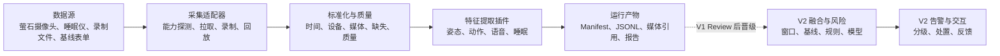

# 康盾工程架构与模块设计

状态：Draft v0.2

更新时间：2026-07-22

适用范围：V1 探索版与 V2 比赛版的共同架构边界

## 1. 两阶段目标

| 版本 | 目标 | 成功标准 | 不追求 |
|---|---|---|---|
| V1 | 快速验证两台设备能拿到什么数据、候选模型能稳定输出什么特征、数据如何对齐和回放 | 同一份录制数据可重复运行，生成带版本和质量信息的多模态特征报告 | 生产级服务、完整告警系统、四风险统一评分 |
| V2 | 将 V1 验证通过的能力组成比赛提交系统 | 萤石真实接入、跌倒主线闭环、可复现实测、演示与离线备用方案 | 50 户生产部署、临床诊断、未验证的硬件能力 |

V1 是探索性工程，不是缩小版生产系统。V1 允许离线文件、单进程、JSONL 和命令行；V2 再引入持久服务、数据库、任务重试和交互闭环。

## 2. 当前系统边界

已确认设备：

1. CS-C6c-V101-1J4WF 摄像头，带麦克风。
2. CS-EP-SDNL1 睡眠仪。

未确认且不能写成已实现能力：

- 手环产生的血氧、连续 HRV、活动半径等数据。
- 门锁产生的出门和访客记录。
- 红外/人体存在传感器产生的房间占用数据。
- 睡眠仪开发接口是否开放原始雷达、实时生命体征、在离床事件或仅日级报告。
- 摄像头开放平台是否允许服务端直接取得带音频的视频流。

## 3. 逻辑架构



核心原则：

- 采集层只描述“观测到了什么”，不直接输出风险结论。
- 模型输出必须同时携带质量、时间范围、模型版本和输入来源。
- 原始视频/音频通过受控文件引用传递，不嵌入事件 JSON。
- V1 优先可回放和可比较，V2 才优先实时性和服务可靠性。
- 无数据、质量差和正常状态是三种不同结果。

## 4. 模块划分

| 模块 | 职责 | V1 | V2 |
|---|---|---|---|
| M0 工程基础 | 配置、运行清单、日志、版本、目录约定 | 必做 | 加入鉴权、审计、部署 |
| M1 信息采集 | 摄像头、睡眠仪、文件、表单适配 | 当前首要模块 | 真实设备持续接入 |
| M2 预处理与质量 | 解码、抽帧、音频切片、时间对齐、质量判断 | 必做 | 实时队列与失败重试 |
| M3 特征提取 | 视频姿态/活动、音频 VAD/ASR/声学、睡眠字段映射 | 候选模型对比 | 固化选定模型 |
| M4 融合与基线 | 多模态窗口、缺失处理、日级聚合、个体基线 | 只定义接口 | 实现 |
| M5 风险任务 | 跌倒、诈骗、认知/抑郁趋势 | 不做正式评分 | 跌倒 P0，其他受范围门控制 |
| M6 告警与处置 | 分级、去重、升级、反馈 | 不实现 | 实现比赛闭环 |
| M7 评测与报告 | 数据完整性、模型可用性、延迟、场景报告 | 必做 | 比赛证据链 |

模块之间不能读取彼此的内部产物目录或数据库表，只通过版本化契约交互。

## 5. V1 运行形态

V1 采用一次运行一个目录的离线流水线：

```text
runs/<run_id>/
├── manifest.json
├── source_assets.jsonl
├── observations.jsonl
├── features.jsonl
├── multimodal_windows.jsonl
├── reports/
├── logs/
└── artifacts/
```

这样可以在没有数据库和消息队列的情况下验证：

- 同一输入是否得到稳定输出。
- 不同模型的结果是否可以横向比较。
- 时间戳、质量和缺失模态是否表达清楚。
- 哪些特征值得进入 V2。

## 6. V1 最小公共契约

### SourceAsset

描述原始输入：asset_id、modality、source_type、evidence_level、URI、起止时间、校验摘要、隐私等级和技术元数据。

### Observation

描述标准化观测：observation_id、asset_id、elder_ref、device_ref、observed_at、time_range、quality_status、quality_metrics 和 missing_reasons。

### FeatureEvent

描述模型派生信息：feature_id、observation_id、feature_type、value、unit、confidence、quality、extractor_name、extractor_version、time_range。

### ModelBinding 与 MultimodalWindow

ModelBinding 冻结模型仓库、框架版本、权重摘要、许可证、设备和推理配置。MultimodalWindow 使用媒体相对毫秒，把姿态帧、语音段、转写引用和词面标签聚合到固定窗口；窗口保留来源引用，不复制原始媒体。

### RunManifest

描述一次可复现实验：run_id、stage、evidence_level、配置摘要、代码版本与 dirty 状态、输入 ID、步骤状态、开始/结束时间、问题和产物路径。多模态模型由显式 ModelBinding 记录；设备探针仍可先把硬件版本写入 configuration，V1-R1 再决定最终公共字段。

V1 暂不冻结 RiskAssessment、AlertEvent 和 FeedbackEvent；这些对象在 V1 Review 后，根据实际可获得的特征设计 V2 版本。

## 7. V1 简化项与偿还点

| V1 简化 | 目的 | V2 偿还 |
|---|---|---|
| 本地 MP4/WAV 优先 | 不等待平台权限即可测试模型 | 替换为萤石实时/回放适配器 |
| 单进程顺序执行 | 快速调试和观察中间结果 | 采集与推理 Worker 解耦 |
| JSONL 文件存储 | 易检查、易比较 | PostgreSQL + 对象存储 |
| 规则和统计特征优先 | 先判断数据是否可用 | 再选择时序模型和融合策略 |
| 单人、单路摄像头 | 控制实验变量 | 扩展多人、遮挡和多机位 |
| 不做自动模型更新 | 保证结果可追溯 | 仍只允许离线审核后更新 |

## 8. V2 目标形态

V2 默认采用模块化单体，而不是微服务：

- 一个业务 API。
- 一个采集/推理 Worker，可按需要拆出 GPU 进程。
- PostgreSQL 与受控媒体存储。
- 数据库 Outbox 驱动关键告警重试。
- 一个小程序或 H5 交互端。

V2 是否引入独立推理服务、Redis 或任务队列，由 V1 的吞吐与延迟报告决定，不预先引入。

## 9. 架构变更规则

以下变化必须进入 [Review 记录](review-log.md)：

- 增加或删除设备/模态。
- 更换公共契约字段或时间语义。
- 候选模型晋级为 V2 正式模型。
- 将“探索特征”升级为风险判断依据。
- 改变原始媒体上传、留存或访问策略。
