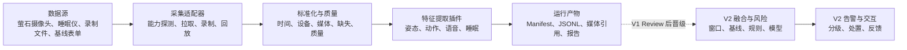

# 康盾工程架构与模块设计

状态：Draft v1.2

更新时间：2026-07-23

适用范围：V1 探索版与 V2 比赛版的共同架构边界

## 1. 两阶段目标

| 版本 | 目标 | 成功标准 | 不追求 |
|---|---|---|---|
| V1 | 快速验证两台设备能拿到什么数据、候选模型能稳定输出什么特征、数据如何对齐和回放 | 同一份录制数据可重复运行，生成带版本和质量信息的多模态特征报告 | 生产级服务、完整告警系统、四风险统一评分 |
| V2 | 将 V1 验证通过的能力组成比赛提交系统 | 萤石真实接入、跌倒主线闭环、可复现实测、演示与离线备用方案 | 50 户生产部署、临床诊断、未验证的硬件能力 |

V1 是探索性工程，不是缩小版生产系统。V1 允许离线文件、单进程、JSONL 和命令行；V2 再引入持久服务、数据库、任务重试和交互闭环。

## 2. 当前系统边界

已确认设备：

1. CS-C6c-V101-1J4WF 摄像头，带麦克风。
2. CS-EP-SDNL1 睡眠仪。

未确认且不能写成已实现能力：

- 手环产生的血氧、连续 HRV、活动半径等数据。
- 门锁产生的出门和访客记录。
- 红外/人体存在传感器产生的房间占用数据。
- 睡眠仪开发接口是否开放原始雷达、实时生命体征、在离床事件或仅日级报告。
- 摄像头开放平台是否允许服务端直接取得带音频的视频流。

公开数据集属于模型和工程基线输入，不属于当前设备边界。URFD/FLEURS 可以提供 E1 的固定回放和标签评测，但不能证明 C6c/CS-EP-SDNL1 已接入，也不能提升目标设备能力矩阵。

## 3. 逻辑架构



核心原则：

- 采集层只描述“观测到了什么”，不直接输出风险结论。
- 模型输出必须同时携带质量、时间范围、模型版本和输入来源。
- 原始视频/音频通过受控文件引用传递，不嵌入事件 JSON。
- V1 优先可回放和可比较，V2 才优先实时性和服务可靠性。
- 无数据、质量差和正常状态是三种不同结果。

## 4. 模块划分

| 模块 | 职责 | V1 | V2 |
|---|---|---|---|
| M0 工程基础 | 配置、运行清单、日志、版本、目录约定 | 必做 | 加入鉴权、审计、部署 |
| M1 信息采集 | 摄像头、睡眠仪、文件、表单适配 | 当前首要模块 | 真实设备持续接入 |
| M2 预处理与质量 | 解码、抽帧、音频切片、时间对齐、质量判断 | 必做 | 实时队列与失败重试 |
| M3 特征提取 | 视频姿态/活动、音频 VAD/ASR/声学、睡眠字段映射 | 候选模型对比 | 固化选定模型 |
| M4 融合与基线 | 多模态窗口、缺失处理、日级聚合、个体基线 | 只定义接口 | 实现 |
| M5 风险任务 | 跌倒、诈骗、认知/抑郁趋势 | 不做正式评分 | 跌倒 P0，其他受范围门控制 |
| M6 告警与处置 | 分级、去重、升级、反馈 | 不实现 | 实现比赛闭环 |
| M7 评测与报告 | 数据完整性、模型可用性、延迟、场景报告 | 必做 | 比赛证据链 |

模块之间不能读取彼此的内部产物目录或数据库表，只通过版本化契约交互。

M7 在 V1-M2b 增加“固定数据源清单 → 数据准备 → 单 case run → 套件汇总”子链路。数据准备器只生成可回放媒体、标签 sidecar 和 lock；模型 Pipeline 仍只消费标准媒体，评测器只读取 FeatureEvent、sidecar 和 PipelineReport，不把数据集专用标签渗入在线提取器。

V1-M3 在 M3/M7 之间增加“同一 PoseBackend 契约 → 视频-only variant runner → 阶段/质量/性能对比”。在线姿态事件不读取 URFD 标签；标签只在评测器中按媒体相对时间匹配。RTMPose 与 TorchVision Keypoint R-CNN 均通过 adapter 输出既有 PoseDetection 和短时 IoU ID，避免候选框架反向改变公共数据契约；Keypoint R-CNN 的 heatmap logit 只转换为未校准质量代理。

语言切片沿用相同边界：“同一 SpeechBackend 契约 → audio-only variant runner → CER/静音/性能对比”。FunASR 与 Whisper 都只返回 SpeechSegment；参考文本仅由 M7 评测器读取，提取器不能读取或调参。逐句转写停留在被忽略的 child FeatureEvent，case/variant/父报告只包含字符计数和聚合指标。

睡眠切片不选择模型，而在 M1/M3 之间设置 fail-closed schema gate：“无值字段 profile → 监测需求 policy + 人工 mapping → route assessment”。E1/fixture 只能生成 candidate；只有 E2/E3、单位/时间/值域/缺失语义完整的单字段可以授权后续 adapter。多夜节律派生在连续覆盖审计前保持禁用，避免把商品能力或字段名误写成标准医学指标。

V1-M2c 在 M1/M2 之间增加独立容器时间戳探针：“本地原始容器 → PyAV stream/packet 扫描 → ContainerTimingReport”。它确认同容器轨道、time base、PTS/DTS 完整性和首尾容器偏移，但固定 `drift_estimate_available=false`；只有真实录制中的两个跨模态同步事件才能形成 offset/drift 验收。E1 工具通过不会提升 C6c 的设备证据等级。

M2a/M2c 之间再复用该报告形成同容器语言入口：“单音视频容器 → strict timing gate → PyAV 单声道 16 kHz → SpeechBackend → 按 audio-minus-video offset 平移 FeatureEvent”。解码器不自行选择轨道或推断零点；多轨、缺 PTS、扫描截断和音频 PTS 逆序均失败。相同容器只形成一个 SourceAsset/Observation，Pipeline report 显式区分 `same_container_pts` 与历史 `separate_files_synthetic_common_zero`。这关闭的是 adapter seam，不是 C6c 取流或 drift 证据。

V1-M2c 另在 M1/M7 之间增加“受控采集包 → strict manifest/场景 policy → 文件摘要与媒体探针 → held-out/覆盖聚合”的就绪门。子 clip 只发布 `structurally_usable`；只有非 fixture E2、同意/能力快照、8 个核心 clip、双同步事件和三模型策略摘要同时通过，父级才发布 `camera_ready_for_model_retest`。完整 C01～C10 与真实 SDNL1 导出再打开 `capture_bundle_ready_for_review`；它只验收采集输入，不替代下游模型/语言/字段报告或整个 M2c 里程碑。这样 E1 fixture 即使结构 10/10 也不能冒充真机数据。

V1-R1 G4 在 M3/M7 之间增加“干净 PoseModelComparisonReport + child pose events → box/keypoint 时序特征 → phase/class 汇总”。特征提取器只读取姿态事件，不读取 URFD 阶段标签；标签只由评测器按媒体相对时间匹配。每帧必须选择 `box_plus_keypoints`、`box_only` 或 `unavailable` 并保留 fallback reason；本层固定不产生 RiskAssessment 或 Alert。

G4 另设不污染 M2b 跨模态 case schema 的 CAUCAFall ADL 压力支路：“冻结官方下载清单 → 未转码视频 + dataset lock → 三姿态 variant/case child run → activity/illumination 父汇总”。原始框/关键点只留在被忽略的 child features，父报告只发布摘要。该支路只验证公开无跌倒 ADL 中的覆盖和代理混淆，不产生分类误报率。

G4 再增加一条与视频事件严格隔离的 Open Images 静态人物检测支路：“逐图许可证审计 + 官方标签/框与像素摘要 → 独立图片单次推理 → IoU 0.5 人物框匹配 → furniture/pet/multi-person 父汇总”。静态 runner 强制关闭 tracking，不把图片重复成伪视频；person-absent 只报告人物 false activation，多人物只报告框级匹配。该支路不运行 G4 运动特征，也不关闭床上躺卧、跌倒、时序事件或 C6c 域内验证。

G4 事件评估支路位于 M2c/M3 与 M7 之间：“严格 capture/readiness 血缘 + 双人独立动作区间 + 裁决真值 + 外部 candidate episode → agreement/TP/FP/FN/误触发/延迟”。evaluator 不执行候选生成策略，只要求三个 variant 绑定同一 candidate-policy 摘要；原始 annotation/candidate 时间、annotator ref 和路径不进入父报告。fixture/sub-E2 只能发布 `tooling_only`，真实全部 clip 可用、camera gate、标注、裁决、最低数据和 clean provenance 同时通过后才发布 `event_metrics_ready_for_review`，且仍不产生 RiskAssessment 或 Alert。

G4 candidate-generator 位于 frame feature 与事件 evaluator 之间：“同 track 下降历史 + 横卧持续/低运动 → 状态机确认 → release/refractory 去重 episode”。生成 API 不接收标签；精确 episode 只进入 derived-sensitive run feature，公开压力父报告只保存激活、路径计数和 delay 摘要。策略在查看 C6c held-out 输出前冻结，公开 URFD/CAUCAFall 复用结果只属于 E1 开发压力，不能作为目标设备或独立泛化证据。

G4 capture feature producer 位于 M2c readiness 与 export bridge 之间：“经摘要验证的 clip + 单一 frozen pose variant → pose event → G4 frame feature → `FallFeatureCaptureSet` + 聚合报告”。推理 context 不暴露身份、annotation window 或 expected-person；每个 clip 重置 tracker，原始 pose 只留在被忽略的 derived-sensitive run，父报告不保存路径或坐标。fixture 只能 E1，真实输入还必须通过 E2 camera gate；本层固定不执行 candidate、风险或告警。

G4 capture export bridge 把开发状态机接到真实事件 evaluator，而不让两侧私下约定 JSON：“capture manifest + capture-bound `FallFeatureCaptureSet` + clean feature source run → 逐 clip 摘要/时间轴校验 → frozen candidate state machine → `FallCandidatePredictionSet` + clean candidate source run”。prediction 使用 evaluator 的公开契约，candidate run configuration 绑定 capture/model/feature/candidate policy 与 prediction SHA-256；时间戳、candidate ID 和窗口只留在 derived-sensitive prediction，timestamp-free summary 不保存路径或窗口。当前 E1 rule-bearing fixture 已验证三 variant 状态机到 evaluator 的接口，真实 C6c 数据仍 Open。

G4 event-bundle assembler 将 capture/readiness、双标注/裁决、冻结 candidate policy 与三路 prediction/source manifest 复制到 owner-only staging，调用原 evaluator 完成 strict preflight 后才原子发布。bundle 只使用相对路径、大小和 SHA-256，不复制 capture 原媒体；失败会删除 staging 且不覆盖既有输出。“组装成功”与 `event_metrics_ready_for_review` 分离，fixture、camera、数据或 provenance 门仍由 evaluator 如实关闭。

V1-R1 在 M0/M7 之间增加比赛提交分发就绪链：“八个仓库事实来源及摘要 → 十三个资产 disposition → 五个人工决定 + 三个发布文件 → 五个 readiness gate”。第八个来源是候选 runtime profile。该链只判断当前 profile 的证据是否完备，不给出法律意见，也不自动选择项目许可证。`exclude` 资产不得进入提交包；`include` 或 `undecided` 资产只要未清门、来源漂移，或 required file 没有非空内容和冻结摘要，最终 `submission_bundle_ready` 就保持 false。

依赖资产在生成最终 lock 前还要经过独立 runtime closure 链：“候选 profile + 脱敏 `pip inspect` → 根 extras/目标 marker 传播 → 实际传递闭包 → 版本、禁入包、安装来源、环境纯净度和许可证 metadata 八门”。该链只产生 candidate snapshot，不自动安装包、不生成最终 lock/NOTICE，也不把当前共享开发环境解释成比赛环境。

## 5. V1 运行形态

V1 采用一次运行一个目录的离线流水线：

```text
runs/<run_id>/
├── manifest.json
├── source_assets.jsonl
├── observations.jsonl
├── features.jsonl
├── multimodal_windows.jsonl
├── reports/
├── logs/
└── artifacts/
```

`RunArtifacts` 是该目录的唯一写入口：用户传入的 runs 根、run 与子目录均固定为 owner-only `0700`，原子 JSON 和追加 JSONL 固定为 `0600`。尤其是 bbox/keypoints/track 和完整转写所在的 derived-sensitive JSONL，不依赖宿主机默认 umask。

所有正式 Slurm 入口在读取业务输入前统一 source `scripts/slurm/runtime.sh` 的 `slurm-runtime-v0.2.0` 契约，并且只能由 `scripts/slurm/submit.sh` 提交。提交器要求仓库 clean，冻结提交时的完整 40 位 commit；计算节点启动时必须仍位于同一 commit，排队期间 checkout 漂移会 fail closed。运行层还要求计算节点可见的 Git 根提交，把 `PYTHONPATH` 绑定到该 checkout 的 `src/` 并反查实际 import 路径，同时先将 stdout、runs 根分别固定为 `0600/0700`。RTMPose 入口还在模型准备前验证 cuDNN 9 和 ONNX Runtime CUDA provider 已注册且动态库可加载。该层只冻结批处理执行与证据来源，不替代 RunManifest、模型摘要或 E2/E3 设备证据。

这样可以在没有数据库和消息队列的情况下验证：

- 同一输入是否得到稳定输出。
- 不同模型的结果是否可以横向比较。
- 时间戳、质量和缺失模态是否表达清楚。
- 哪些特征值得进入 V2。

## 6. V1 最小公共契约

### SourceAsset

描述原始输入：asset_id、modality、source_type、evidence_level、URI、起止时间、校验摘要、隐私等级和技术元数据。

### Observation

描述标准化观测：observation_id、asset_id、elder_ref、device_ref、observed_at、time_range、quality_status、quality_metrics 和 missing_reasons。

### FeatureEvent

描述模型派生信息：feature_id、observation_id、feature_type、value、unit、confidence、quality、extractor_name、extractor_version、time_range。

### ModelBinding 与 MultimodalWindow

ModelBinding 冻结模型仓库、框架版本、权重摘要、许可证、设备和推理配置。MultimodalWindow 使用媒体相对毫秒，把姿态帧、语音段、转写引用和词面标签聚合到固定窗口；窗口保留来源引用，不复制原始媒体。

### DatasetBenchmarkCase 与 DatasetBenchmarkReport

DatasetBenchmarkCase 只用于离线评测，冻结公开来源、配对类型、标签 sidecar 和参考转写。DatasetCaseEvaluation 分别记录视频覆盖率/阶段指标和语音 CER；DatasetBenchmarkReport 做加权汇总但不复制参考或识别全文。跨数据集 case 必须声明 `cross_dataset_synthetic_common_zero`，证据等级固定 E1。

### PoseModelComparisonReport

PoseBenchmarkCaseEvaluation 复用相同视频和 sidecar，分别保存人物框覆盖、关键点质量、轨迹字段和帧耗时。PoseBenchmarkVariantReport 对 class/phase 加权汇总；PoseModelComparisonReport 只计算预先指定的 variant 差值。模型框覆盖、关键点质量和 tracker 字段必须分开解释，不允许用“返回了框”替代“关键点足以支持跌倒特征”。

### FallMotionFrameValue 与 FallFeatureBenchmarkReport

FallMotionFrameValue 保存归一化框形状/位置、同 track 的下降/低运动/横卧持续代理、COCO-17 关键点质量门、feature path 和 fallback reason；不复制原始 bbox、关键点或阶段标签。FallFeatureBenchmarkReport 只在评测层按 case/class/phase 聚合 available 与代理激活数，并以 Literal `false` 固定 `risk_assessment_emitted` 和 `alert_emitted`。来源 parent/child run、代码版本、模型 digest、配置和 sidecar 摘要不一致时 fail closed。

### FallEventCandidatePolicy 与 FallCandidatePublicStressReport

FallEventCandidatePolicy 冻结 transition/settled 两条触发路径、帧间隔、release、refractory、episode 起点和 label-blind 约束。FallEventCandidateEpisode 只表达候选窗口与 trigger path，固定不是风险或告警。公开压力 case/variant/parent report 只保存 URFD fall 激活覆盖、URFD/CAUCAFall negative activation、episode/hour 和 coarse phase-onset delay 摘要；精确窗口和 track 身份不进入父报告。完整设计见[跌倒候选 episode 设计](v1-g4-fall-event-candidates.md)。

### StaticHomeImageCase 与 StaticHomeBenchmarkReport

StaticHomeImageCase 固定 Open Images validation 图片摘要、尺寸、场景、Person 人工验证标签与 normalized Person boxes；逐图作者、标题和许可证只进入独立 attribution 资产，不复制到评测报告。StaticHomeCaseEvaluation 保存匹配/FP/FN 计数、平均匹配 IoU 与单图耗时，不保存预测坐标。StaticHomeGroupMetrics 按家具无人、宠物无人和室内多人汇总 false activation、precision/recall 与多人完整匹配；variant/parent report 固定 `risk_assessment_emitted=false`、`alert_emitted=false`。

### ContainerTimingReport

MediaStreamTiming 保存每条视频/音频轨的 codec、time base、声明时间、逐包 PTS/DTS 完整性、时间范围、步长与技术元数据；ContainerTimingReport 汇总轨道数、同容器状态和首尾相对偏移。报告不保存容器 metadata value 或源路径，并把扫描截断显式降级为 partial。duration delta 只是轨道时间范围差，不得解释为 drift。

### M2cCaptureReadinessReport

M2cClipReadiness 只保存 opaque clip/asset ref、scenario ID、摘要/大小匹配、轨道状态、标注标签集合/数量和双事件派生 offset/drift，不保存身份、路径或原始窗口。父报告把结构可用数、核心/full-matrix 缺口、三模型策略验证和睡眠文件验证分开，并独立发布摄像头复测、完整矩阵、睡眠 profile 与 M2c Review 四个布尔门。路径越界、文件漂移、fixture marker、真实 clip 重复摘要或 held-out 策略漂移均 fail closed。

### FallEventEvaluationReadinessReport

FallEventAnnotationAgreement 只保存 pair 序号、窗口计数、interval F1 和 fall 起点差摘要；FallEventCaseEvaluation / VariantEvaluation 保存 scenario、暴露时长、TP/FP/FN、误触发率与 delay 摘要，不复制标注/候选时间。父报告分别发布 annotation coverage、agreement、adjudication、minimum data、source provenance 和 capture camera gate；任何输入路径/大小/摘要、held-out 时间、variant/model/feature/candidate policy 或来源 run 配置漂移都 fail closed。`event_metrics_ready_for_review` 只表示真实 E2+ 指标可交人工评审，不授权 M5/M6。

### DistributionReadinessReport

DistributionReadinessReport 把项目代码、依赖闭包、模型 artifact 与评测数据分别记录为 `include`、`exclude` 或 `undecided`，并逐项保存 clearance、官方来源和未决要求。报告同时核对事实来源摘要、人工决定和 `LICENSE` / NOTICE / competition lock 的内容摘要；任一非排除资产未清门或来源漂移时 fail closed。它固定 `legal_advice_provided=false`、`risk_assessment_emitted=false` 和 `alert_emitted=false`，只作为人工 Release Review 的工程前置门。

### RuntimeClosureReport

RuntimeClosureReport 从候选 profile 和脱敏 inventory 计算直接依赖与传递闭包，显式传播根 extras 并按 profile 目标环境解释 PEP 508 marker。报告分别发布 target、repository source、direct requirements、dependency closure、prohibited closure、installation provenance、isolation 和 license metadata 八个 gate；本地路径、URL 值、`PYTHONPATH` 内容和许可证正文不落盘。它固定 `candidate_only=true`，且不产生 competition lock、NOTICE、法律意见、RiskAssessment 或 Alert。

### RunManifest

描述一次可复现实验：run_id、stage、evidence_level、配置摘要、代码版本与 dirty 状态、输入 ID、步骤状态、开始/结束时间、问题和产物路径。多模态模型由显式 ModelBinding 记录；设备探针仍可先把硬件版本写入 configuration，V1-R1 再决定最终公共字段。

V1 暂不冻结 RiskAssessment、AlertEvent 和 FeedbackEvent；这些对象在 V1 Review 后，根据实际可获得的特征设计 V2 版本。

## 7. V1 简化项与偿还点

| V1 简化 | 目的 | V2 偿还 |
|---|---|---|
| 本地音视频容器或独立 MP4/WAV 优先 | 不等待平台权限即可测试模型和 PTS adapter | 替换为萤石实时/回放适配器；保留同一 timing gate |
| 单进程顺序执行 | 快速调试和观察中间结果 | 采集与推理 Worker 解耦 |
| JSONL 文件存储 | 易检查、易比较 | PostgreSQL + 对象存储 |
| 规则和统计特征优先 | 先判断数据是否可用 | 再选择时序模型和融合策略 |
| 单人、单路摄像头 | 控制实验变量 | 扩展多人、遮挡和多机位 |
| 不做自动模型更新 | 保证结果可追溯 | 仍只允许离线审核后更新 |

## 8. V1-R1 架构输入冻结

V1-R1 将架构能力分为三层：

1. 直接进入 V2-D1 的基线：公共契约、运行 provenance、回放/评测接口、隐私与证据等级、睡眠 fail-closed gate。
2. 只进入候选接口的实现：HumanArt + RTMPose、TorchVision Keypoint R-CNN fallback、FunASR 和跌倒 box/keypoint 特征；在目标设备、负样本或许可证门关闭前不能成为正式能力。
3. 不进入当前主路径的能力：YOLO26n 默认姿态、Whisper 普通话主链路、睡眠模型、自动诈骗/认知/抑郁评分，以及无设备证据的 HRV/SpO2/AHI 等字段。

V2-D1 可以在真机到位前继续设计 adapter seam；媒体 PTS、采集包 readiness、G4 跌倒运动特征、首版 label-blind candidate、静态人物检测压力、事件评估工具，以及 G5 分发/候选 runtime closure 工具均已完成，但真实 G2/G3/G4、提交包 G5 决策和最终运行环境仍未关闭。当前共享环境的 closure 仅 3/8 ready，只能作为构建隔离候选环境的缺口清单。G4 当前只提供离线 feature/candidate/fallback、静态 person-detection 与 E1 scorer 契约证据，不能进入 RiskAssessment 或告警；G5 工具通过也不等于提交包就绪。系统必须同时保留三种运行声明：真实平台接入、受控文件回放、能力 blocked。三者不得共享同一个“已接入”状态。

完整决策 ID、许可证边界和硬门见 [V1-R1 探索收敛与 V2 输入清单](v1-r1-exploration-review.md)。

## 9. V2 目标形态

V2 默认采用模块化单体，而不是微服务：

- 一个业务 API。
- 一个采集/推理 Worker，可按需要拆出 GPU 进程。
- PostgreSQL 与受控媒体存储。
- 数据库 Outbox 驱动关键告警重试。
- 一个小程序或 H5 交互端。

V2 是否引入独立推理服务、Redis 或任务队列，由 V1 的吞吐与延迟报告决定，不预先引入。

## 10. 架构变更规则

以下变化必须进入 [Review 记录](review-log.md)：

- 增加或删除设备/模态。
- 更换公共契约字段或时间语义。
- 候选模型晋级为 V2 正式模型。
- 将“探索特征”升级为风险判断依据。
- 改变原始媒体上传、留存或访问策略。
