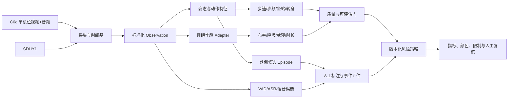

# KangShield 系统架构

状态：Draft v2.0
更新时间：2026-08-08

## 目标与边界

系统面向独居老人跌倒风险提示，使用一台 C6c 摄像头的视频与音频和一台 SDHY1 睡眠仪，形成可追溯的指标、跌倒/语音候选、质量状态和人工复核材料。系统不提供医疗诊断。

- `1 × CS-C6c-V101-1J4WF`：单机位视频输入；不建设双机位或跨视角融合。
- `1 × CS-EP-SDHY1`：睡眠心率、呼吸率、在离床和睡眠报告输入。
- 不引入手环、门锁、RGB-D、压力步道或第二台摄像头。

## 分层架构

## 模块职责

| 模块 | 职责 | 禁止事项 |
|---|---|---|
| 采集层 | 有界取流、owner-only 原始产物、PTS/DTS、session ledger | 静默重连后伪装为连续媒体 |
| 观测层 | 统一来源、时间、单位、质量和证据等级 | 把 fixture 晋级为真机证据 |
| 姿态层 | 人体框、COCO-17 关键点、短时 track | 在低质量帧补猜姿态 |
| 语音层 | 音频 PTS、VAD、普通话 ASR、求助/跌倒相关 candidate | 声纹、情绪/认知评分或用转写直接确认跌倒 |
| 指标层 | 步速、步频、坐站、转身与睡眠字段 | 未标定时输出绝对步速 |
| 事件层 | label-blind candidate、标注、裁决、TP/FP/FN | 用公开集结果宣传目标域准确率 |
| 策略层 | 配置化 0～3 分、颜色和组级合成 | policy 未冻结时输出正式总风险 |
| 展示层 | 数值、质量、限制、来源和人工确认状态 | 隐藏不可评估或降级原因 |

## 公共数据原则

每项 `IndicatorObservation` 至少包含：`observation_id`、`indicator_id`、`group`、`source_modality`、`source_ref`、`value`、`unit`、`time_range`、`quality_status`、`quality_metrics`、`assessability`、`sample_count` 和 `limitations`。评分结果另用 `IndicatorAssessment` 绑定 policy revision 与摘要，详见[指标公共契约](indicator-contracts.md)。

原始视频和健康值保持 owner-only；公开报告只保存摘要、计数、质量、决策和脱敏引用。

## 当前不做

- 双机位融合和三维重建。
- 诈骗识别、声纹身份、情绪、认知或抑郁自动评分。
- HRV、SpO2、AHI、血压、体温或原始雷达推断。
- 在线自学习、自动改阈值或无人工 Review 的模型更新。
- 在来源和本地验证未关闭前宣称临床阈值或预测性能。
