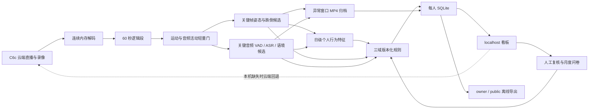

# KangShield 系统架构

状态：MVP v0.6
更新时间：2026-08-30

## 目标与边界

系统以一位老人和一台目标 C6c 为中心，持续整理跌倒、心理健康和诈骗三个独立风险域。辅助摄像头不进入评分；已确认可用的睡眠规律可作为心理健康域的一项个人特征。

系统不输出全局总分，不做医疗诊断、诈骗确认、表情/声学情绪识别或自动外部告警。

## 主链

## 分层职责

| 层 | 负责 | 明确禁止 |
|---|---|---|
| 云端媒体 | 保存原始录像并按事件时间提供临时回放 | 把云端 token、播放 URL 或设备序列号写入数据库 |
| 连续采集 | 在内存中解码单视频轨与单音频轨，建立逻辑段和 PTS | 保存完整连续分段或直播地址 |
| 轻量门 | 5 fps 灰度帧差、周期基线帧、音频 RMS/噪声底 | 直接评分或把轻量扫描算作重模型有效覆盖 |
| 模型分析 | 对选中窗口运行人体姿态、VAD 和普通话 ASR | 模型失败时伪造阴性证据 |
| 候选与个人特征 | 跌倒 episode、语境候选、日间出现率、活动和语言互动 | 将候选直接当成确诊事件 |
| 规则策略 | 三域独立 `0–3/null`，绑定 revision 与 SHA-256 | 生成全局分数、概率或临床结论 |
| 异常归档 | 只把候选前 10 秒至后 20 秒编码为 owner-only MP4，执行 30 天/2 GiB 上限 | 保存无候选的连续媒体或向 public 导出路径 |
| 长程存储 | 保存审计、覆盖、派生特征、候选、归档索引、assessment、复核和问卷 | 保存完整逐字稿、直播地址或临时云播放地址 |
| 本地产品 | 三域卡、28 天个人趋势、事件回看、复核、问卷、文档 | 绑定公网地址或提供任意路径读取 |
| 导出 | owner 完整照护报告与 public 脱敏报告 | public 泄露身份、转写、备注、路径或精确时间 |

## 连续性与失败语义

采集生产线程与单模型消费线程分离，最多保留两个内存段。队列满写 `analysis_backpressure`；断流、时间戳缺失、轨道错误和模型失败使用固定失败码。失败不会阻塞 Web 服务，但相应覆盖保持为 0，风险按 `model_unavailable/null` 或 `insufficient_data/null` 降级。

每段落库的是轻量审计：起止时间、选择策略摘要、实际送模覆盖、候选数、归档成功/失败数和失败码。产生候选后，模型工作线程直接从仍在内存的 JPEG/PCM 编码带声音 MP4；连续完整分段不落盘。看板优先使用短期随机令牌播放本机归档，文件缺失时再按事件时间临时解析云回放。

## 以个人为中心

心理健康行为侧仅与本人最近 28 天稳健基线比较。至少 7 个不同日期、每天 3 个合格段后才建立基线；前端只展示相对本人基线的平稳、轻度变化或明显变化，不展示人群排名。每月 WHO-5 是本人主动提供的补充证据，不能被解释为诊断。
