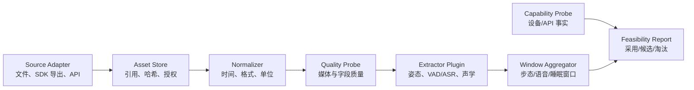

# 信息侧模块详细技术路线

状态：Implementation Baseline v1.3

更新时间：2026-07-23

适用里程碑：V1-M1～V1-R1

## 1. 目标和完成定义

信息侧负责回答三个问题：

1. 两台设备事实上开放了哪些数据和操作？
2. 原始媒体与设备记录是否具备足够质量，可供候选模型处理？
3. 每个模型输出能否在固定输入上稳定复现，并转换为统一 FeatureEvent？

V1 信息侧完成不等于“风险系统完成”。它的交付是可审计的数据证据：

- 设备能力探测结果。
- 原始输入的摘要、哈希和隐私等级。
- 标准化 Observation。
- 媒体/字段质量报告。
- 候选提取器的版本、速度和 FeatureEvent。
- 一次运行的 RunManifest 与错误记录。

## 2. 证据等级

所有设备与数据能力必须标注证据等级：

| 等级 | 名称 | 含义 | 可否写入比赛“已实现” |
|---|---|---|---|
| E0 | 需求/文档声明 | 来自方案、产品页或接口文档，尚未在本账号验证 | 否 |
| E1 | Synthetic Fixture | 人工构造的接口形状，只用于开发和测试 | 否 |
| E2 | Recorded Export | 来自真实设备或 SDK 的脱敏导出，尚未重复调用 | 只能写“已获得样例” |
| E3 | Live Verified | 使用比赛账号和目标设备成功调用，并保存脱敏证据 | 可以 |
| E4 | Repeatable Verified | 多次、跨时间或跨场景成功，且有成功率/缺失率 | 可以作为稳定能力 |

Mock 和 Fixture 永远不能自动晋级。晋级必须由 Review 记录证据路径、调用时间和结论。

## 3. 总体数据流



设备能力探测与媒体模型处理并行，但不能互相替代：

- 设备 API 未接通时，可以用录制文件探索模型。
- 模型在公开数据表现良好，不能证明目标设备视频质量足够。
- 产品页列出某项硬件参数，不能证明开发账号能取得对应字段。

## 4. 代码模块

```text
src/kangshield/information/
├── contracts.py          # SourceAsset、Observation、FeatureEvent、RunManifest
├── artifacts.py          # 运行目录、原子写入、JSONL、代码版本
├── privacy.py            # 内容摘要、稳定引用和结构脱敏
├── media_probe.py        # 文件、WAV、OpenCV 视频事实与质量探测
├── container_timing.py   # PyAV 轨道/包时间戳、容器偏移与扫描上限
├── sleep_profile.py      # JSON/CSV 字段发现与映射候选
├── ezviz_snapshot.py     # SDK/API 脱敏快照分析与证据分级
├── extractor.py          # 通用模型插件 Protocol
├── streaming.py          # OpenCV 回放、PCM WAV、同容器音轨 PTS 解码/重采样
├── pose_backend.py       # YOLO26n-pose + ByteTrack 适配器
├── fall_features.py      # 跌倒运动代理、关键点质量门与离线评测
├── fall_feature_capture.py # capture clip 的 pose→G4 feature producer
├── fall_candidates.py    # 无标签候选状态机、来源门与公开压力汇总
├── fall_candidate_export.py # capture-bound G4 特征到 evaluator prediction
├── event_bundle.py       # 三路 prediction 与标注的原子 bundle 组装/preflight
├── distribution_readiness.py # 比赛包资产、决定、文件与分发 gate
├── runtime_closure.py    # 候选 Python runtime 的 extras/marker 依赖闭包 gate
├── speech_backend.py     # FunASR VAD/ASR/标点和词面标签
├── multimodal_pipeline.py # 特征落盘、时间窗对齐和性能报告
├── dataset_preparation.py # 公开固定源校验、媒体转换、case/lock
├── dataset_benchmark.py   # 多 case 调度、标签/CER 和覆盖率汇总
└── cli.py                # V1 命令行入口
```

边界规则：

- contracts 不依赖设备 SDK 或模型框架。
- adapters 不输出风险，只输出 SourceAsset/Observation/ProbeReport。
- 模型插件不直接读其他模块目录，由调用方传入 Observation。
- artifacts 是唯一允许写运行目录的模块。
- 原始媒体默认只引用，不复制；显式指定后才进入受控 artifacts。

## 5. 公共契约

### 5.1 SourceAsset

记录原始输入事实：

| 字段 | 含义 |
|---|---|
| schema_version | 契约版本 |
| asset_id | 由内容哈希派生的稳定 ID |
| modality | video/audio/sleep/device_snapshot |
| source_type | local_file/sdk_export/api_response/fixture |
| evidence_level | E0～E4 |
| uri | 本地或受控对象引用 |
| sha256 | 内容校验摘要 |
| byte_size | 文件大小 |
| captured_start_at/end_at | 设备事件时间；未知时为空 |
| ingested_at | 系统接收时间 |
| privacy_level | raw_sensitive/derived_sensitive/aggregate |
| metadata | 不含密钥和真实序列号的技术元数据 |

mtime 只能描述本地文件时间，不能冒充 captured_at。

### 5.2 Observation

记录一次可处理的标准观测：

- observation_id、asset_id、elder_ref、device_ref。
- modality、time_range、sequence。
- quality_status：pass/partial/fail/unknown。
- quality_metrics：亮度、模糊、采样率、字段完整率等。
- missing_reasons：无音轨、无法解码、接口未开放等。
- payload_ref：派生数据引用。

elder_ref 和 device_ref 使用项目内部引用或单向摘要，公共产物不保存姓名和设备序列号。

### 5.3 FeatureEvent

模型派生信息统一为：

- feature_id、observation_id、feature_type。
- start_at/end_at 或媒体相对 start_ms/end_ms。
- value、unit、confidence、quality。
- extractor_name、extractor_version、model_digest。
- source_feature_refs 与 limitations。

limitations 是正式字段。例如：

- uncalibrated_image_coordinate
- face_too_small
- missing_left_ankle
- far_field_audio
- synthetic_input

### 5.4 RunManifest

一次运行必须记录：

- run_id、stage、status。
- started_at、finished_at。
- code_version 与 dirty 状态。
- 配置摘要和输入摘要。
- 步骤列表、成功/失败、耗时。
- 产物相对路径。
- issues 与 evidence_level。

任何报告都应能反查到 RunManifest。

## 6. 运行目录与写入规则

```text
runs/<run_id>/
├── manifest.json
├── source_assets.jsonl
├── observations.jsonl
├── features.jsonl
├── multimodal_windows.jsonl
├── reports/
│   ├── media_probe.json
│   ├── sleep_field_profile.json
│   ├── ezviz_capability_snapshot.json
│   └── multimodal-pipeline-report.json
├── logs/
│   └── events.jsonl
└── artifacts/
```

规则：

1. JSON 文件采用临时文件 + rename 原子替换。
2. JSONL 每行一个完整对象，写入后可逐行恢复。
3. manifest 最后写入完成状态；异常退出保留 running/failed 证据。
4. 默认不把原始媒体复制进 runs。
5. reports 不保存 accessToken、AppKey、验证码、设备序列号或真实姓名。
6. runs 默认被 Git 忽略。
7. 用户传入的 runs 根、每个 run 及其 `reports/logs/artifacts` 子目录固定 `0700`，JSON/JSONL 固定 `0600`；权限漂移的运行不得作为正式证据。
8. 正式 Slurm 入口统一经 `scripts/slurm/submit.sh` 冻结完整 submit commit，再执行 `slurm-runtime-v0.2.0`；运行时在业务输入前核对 execution commit、shared clean checkout、实际 Python import、owner-only stdout/runs，并按 backend 预检 cuDNN/ONNX Runtime。裸 `sbatch` 不构成正式证据，脚本间也不得复制一份会漂移的 runtime 逻辑。

## 7. 开发路径

### 7.1 媒体探测

命令目标：

```text
kangshield-info probe-media <file> [<file> ...] \
  [--require-audio-track] [--max-packets-per-stream 200000]
```

首版能力：

- 文件大小、MIME、SHA-256。
- WAV 声道、采样率、位深、帧数和时长。
- 可选 OpenCV 视频宽高、FPS、帧数、时长、FourCC。
- 抽样帧亮度、暗帧比例和拉普拉斯模糊度。
- 固定 PyAV 18.0.0 检查容器 video/audio track、codec、time base 和逐包 PTS/DTS。
- 输出首条音视频轨的 start/end offset 与 duration delta，但不在没有同步事件时输出 drift。
- required audio 缺失/不可验证时 fail；扫描达到上限时 partial，不用不完整报告关闭 G2。
- 容器 metadata 只保存 key 数，不保存值或源路径。

确定性 E1 夹具、字段定义和真实 C6c 使用规则见 [V1-M2c 容器音视频时间戳探针](v1-m2c-media-timing-probe.md)。

### 7.2 目标设备采集包就绪门

```text
kangshield-info assess-m2c-capture <capture-manifest.json> \
  --evidence-level E2 --source-type local_file
```

该命令不复制受控原始数据，而是验证 manifest 1.1、包内相对路径、SHA-256/大小、C01～C12 场景/标注、安全控制、媒体轨道、双同步事件和三姿态 variant 策略摘要。报告把“结构可用 clip”“摄像头可开始冻结参数复测”“C01～C10 完整矩阵”“睡眠文件可 profile”和“采集包可进入 Review”分开；最后一项仍不代表下游模型报告或整个 M2c 里程碑已验收。

E1 fixture、template、synthetic 或顶层 fixture marker 永远不能打开真机门。真实集至少需要 8 个核心结构可用 clip 和一个双事件音频 clip；完整 Review 还要求 C01～C10 与一份真实 SDNL1 导出。设计与 E1 结果见[采集包就绪门](v1-m2c-capture-readiness-gate.md)和[初测报告](reports/v1-m2c-capture-readiness-smoke.md)。

### 7.3 睡眠导出字段发现

命令目标：

```text
kangshield-info profile-sleep <json-or-csv>
```

首版不假定 CS-EP-SDNL1 的字段名，而是：

- 展平字段路径。
- 统计类型、非空数和记录数。
- 根据字段名给出 heart_rate、respiratory_rate、presence、sleep_start 等“映射候选”。
- 候选不自动转为标准指标，必须人工确认单位和语义。
- 对 token、serial、name、phone、id 等字段只记录存在性，不记录值。

字段发现之后运行路线 gate：

```text
kangshield-info assess-sleep-route <json-or-csv> \
  --mapping-config <candidate-or-confirmed-map.json>
```

它用绑定《监测方案》摘要的 policy 将字段分成 direct-if-exposed、multi-night derived 和 not-assumed，并逐项检查 evidence、source path、单位、时间、值域及缺失语义。route report 不包含值；`ready_for_adapter` 也只授权后续单字段 adapter，不能解释为设备已验收或指标准确。

### 7.4 萤石 SDK/API 快照分析

命令目标：

```text
kangshield-info inspect-ezviz <sanitized-json> --evidence-level E1|E2|E3
```

首版选择“快照导入”而不是硬编码旧 REST 路径，原因是：

- 萤石当前文档中心和 SDK 版本并存。
- 具体能力必须查询目标设备能力集。
- 睡眠仪可能通过专用接口、组件或人工导出提供数据。

快照分析输出：

- 发现的设备数量和型号。
- 在线/离线字段。
- capability/support 类字段清单。
- 目标型号是否出现。
- 脱敏后的原始结构。
- 尚未验证的直播、回放、抓图、告警、音频和睡眠字段检查项。

后续获得确认过的接口文档后，再实现 LiveTransport；不让不确定接口固化到核心契约。

### 7.5 视频 + 语言多模态回放

```text
kangshield-info run-multimodal <video> <pcm-wav>
kangshield-info run-multimodal <av-container> --audio-from-video
```

独立视频/WAV 模式继续明确标记为 synthetic common zero，只验证窗口工程。`--audio-from-video` 则先复用容器 timing probe，要求恰好一条视频轨和一条音轨、起点 offset 可测、逐包 PTS 完整且扫描未截断，再由 PyAV 解码音轨、重采样为单声道 16 kHz，并把 VAD/ASR 段按有符号 offset 映射到视频时间轴。两个布局都经姿态跟踪和 VAD/中文 ASR 汇入固定毫秒窗口，输出完整 ModelBinding、FeatureEvent、MultimodalWindow 以及 warm/cold 两套性能口径。

同容器只登记一个 SourceAsset/Observation，report 固定记录 `input_layout=same_container_pts` 与 `audio_start_offset_ms`；歧义轨道、缺 PTS、逆序音频 PTS 或 scan truncation 都失败，不回退为共享零点。单个起点 offset 仍不能证明 capture clock 或 drift，真实 C6c 必须按 M2c 规程保留两次同步事件。

实现、命令、模型决策和限制见 [V1 视频与语言多模态 Pipeline](v1-multimodal-pipeline.md)，正偏移真实后端证据见[同容器音轨初测报告](reports/v1-m2a-same-container-audio-smoke.md)。

### 7.6 公开数据固定集评测

```text
kangshield-info benchmark-dataset <benchmark-cases.json>
```

V1-M2b 使用固定 SHA-256 的 URFD/FLEURS 子集验证多样本处理。每个 case 独立运行姿态、跟踪、VAD/ASR 和窗口 Pipeline，再按 URFD 帧阶段标签统计视频覆盖率、按 FLEURS 参考转写统计 corpus CER。两路数据不是自然同步录制，融合窗口只有工程验证含义，结果固定为 E1。数据来源、许可证、准备过程和完整指标口径见 [V1-M2b 数据集评测设计](v1-m2b-public-dataset-benchmark.md)。

### 7.7 跌倒运动特征离线评测

```text
kangshield-info benchmark-fall-features \
  <benchmark-cases.json> <clean-pose-comparison-report.json> \
  --variant rtmpose-m-humanart|yolo26n-pose
```

V1-R1 G4 复用已完成的姿态 child events，只派生 box 横卧/下降/低运动、横卧持续、COCO-17 关键点质量门和 fallback reason。runner 默认拒绝 dirty、未完成、非 E1、代码/模型/输入摘要漂移的姿态来源；阶段标签只进入 evaluator，派生事件不含原始坐标或标签。输出固定不产生 RiskAssessment 或 Alert。设计与 E1 结果见 [G4 设计](v1-g4-fall-motion-features.md)和[正式报告](reports/v1-g4-fall-motion-features.md)。

Open Images 静态居家支路独立消费 4 张家具无人、4 张宠物无人和 4 张室内多人 validation 图片。每张图片单独推理一次并关闭 tracking；负标签只形成 person false activation，多人物只形成 IoU 0.5 框匹配。逐图许可、归因和像素摘要由准备器/lock 固定，评测 parent 不包含框坐标或作者信息。job `1766` 上 RTMPose / YOLO / Keypoint R-CNN 的无人激活为 2/8、3/8、3/8；多人匹配为 11/11、9/11、11/11。该支路不进入 G4 时序特征，也不替代 C6c。设计见[静态压力集](v1-g4-openimages-static-home-stress.md)与[正式报告](reports/v1-g4-openimages-static-home-stress.md)。

事件级评估另走受控 held-out 支路：

```text
kangshield-info assess-event-evaluation <event-evaluation-bundle.json>
```

bundle 同时绑定 M2c capture/readiness 与 clean assessor run、两份以上独立动作区间、裁决真值、一个 candidate-generator policy，以及三姿态 variant 的 candidate episode/clean source run。评测器不运行候选规则，只做 interval agreement 和 `simulated_fall` 一对一匹配，发布 TP/FP/FN、precision/recall/F1、总暴露 false activations/hour、negative-clip activation rate 与 detection-delay 摘要。E1 确定性夹具只验证公式，真实全部 clip、camera、标注、裁决、最低数据和 provenance 门关闭前 `event_metrics_ready_for_review=false`。完整契约见[事件评估就绪门](v1-g4-event-evaluation-readiness.md)。

通过 M2c gate 的 capture 先由单 variant producer 生成 G4 特征：

```text
kangshield-info capture-fall-features \
  <capture-manifest.json> \
  <m2c-capture-readiness.json> \
  <m2c-capture-run-manifest.json> \
  --variant rtmpose-m-humanart
```

该命令只从严格 manifest 暴露经摘要验证的媒体路径、duration 和 variant policy，不向 pose/G4 extractor 传递 annotation window、身份或 expected-person。每个 clip 重置 tracker，pose 与 G4 frame event 留在 derived-sensitive run，父报告只保存覆盖、质量、性能和 provenance 摘要。fixture 固定 E1，非 fixture 还要求 camera gate。设计见 [G4 Capture Feature Producer](v1-g4-fall-feature-capture.md)。

capture-bound G4 特征再通过显式桥接导出 evaluator 输入：

```text
kangshield-info export-fall-candidates \
  <capture-manifest.json> \
  <fall-feature-capture-set.json> \
  <feature-source-run/manifest.json> \
  --policy configs/v1-g4-event-candidate-policy.json
```

该命令不读 annotation/adjudication，只读取 capture 的安全索引、逐 clip `video.fall_motion_frame` 和冻结策略；它校验上游 run、artifact、摘要、variant/model/feature policy、clip order/duration、observation、时间轴和 derived-sensitive 标记，输出 evaluator 直接消费的公开 `FallCandidatePredictionSet` 与 `v1-g4-fall-event-candidates` source run。精确窗口不进入 timestamp-free summary，风险和告警仍为 false。设计见 [G4 Candidate Export Bridge](v1-g4-candidate-export-bridge.md)。

三路 candidate source 到位后，由原子组装器生成 self-contained evaluator bundle：

```text
kangshield-info assemble-event-evaluation-bundle \
  <capture.json> <readiness.json> <readiness-run.json> \
  <candidate-policy.json> <adjudication.json> \
  --annotation <annotation-a.json> --annotation <annotation-b.json> \
  --prediction-source <prediction.json> <candidate-run-manifest.json> \
  --output <new-private-bundle-directory>
```

组装器不修改标签/候选，不复制原媒体，也不覆盖目录；它在 `0700` staging 中以 `0600` 复制敏感 JSON，生成相对路径/大小/摘要引用，调用同一 evaluator preflight 后才原子 rename。正式可评审状态仍由 evaluator gates 决定。设计见 [G4 Event Bundle 组装](v1-g4-event-bundle-assembly.md)。

### 7.8 比赛提交分发就绪门

```text
kangshield-info assess-distribution-readiness \
  --policy configs/v1-r1-distribution-readiness.json \
  --repository-root . \
  --runs-dir runs
```

该命令不读取或复制模型权重和公开数据，只核对八个仓库事实来源摘要、十三项资产 disposition、五个人工决定、三个发布文件和五个 readiness gate。第八个来源是候选 runtime profile。`include` 与 `undecided` 资产未清门、来源配置漂移、required file 缺失/过小/未绑定/摘要不符或 required decision 未确认时，报告均保持 `submission_bundle_ready=false`。`exclude` 只表示资产不进入当前提交包，不代表获得再分发许可。

普通审计在正确产出 blocked 报告时返回成功；Release Candidate 使用 `--require-ready`，报告落盘后仍未就绪则返回 `2`。policy 和 repository root 的本地路径不写入 manifest，owner-only `0700/0600` 规则不变。该门禁固定 `legal_advice_provided=false`，项目许可证、最终权重和打包方式必须由具名 owner 决定。设计与基线分别见[分发就绪门设计](v1-r1-distribution-readiness.md)和[正式 E1 报告](reports/v1-r1-distribution-readiness.md)。

### 7.9 候选 Runtime 依赖闭包门

```text
kangshield-info assess-runtime-closure \
  --profile configs/v1-r1-runtime-profile-rtmpose-funasr.json \
  --repository-root . \
  --runs-dir runs
```

该命令在内存中读取 `pip inspect`，先移除 metadata path、URL 值、editable path、`PYTHONPATH` 内容和许可证正文，再按候选 profile 的八个直接根、extras 与目标环境 marker 计算实际传递闭包。它把直接版本、可选依赖、禁入包、安装来源、闭包外包和许可证 metadata 分成八门；即使 `pip check` 没有报错，缺失的根 extras 依赖仍会 fail closed。

开发盘点可运行 `make PYTHON=.venv/bin/python assess-runtime-closure`，但 Make 入口使用 `PYTHONPATH=src`，installation-provenance gate 必然如实关闭。候选/RC 证据必须来自非 editable、无 `PYTHONPATH` 的已安装入口，并以 `--require-ready` 作为硬门。当前共享环境仅 3/8 ready；工具不安装/卸载包，不生成 competition lock 或 NOTICE。详细契约与证据见[候选 Runtime 依赖闭包门](v1-r1-runtime-closure.md)和[正式 E1 报告](reports/v1-r1-runtime-closure.md)。

## 8. 模型接入路线

模型按“先输入可用性，再输出精度”推进：

### 阶段 A：无模型质量探测

- 视频：解码成功率、FPS 稳定性、亮度、模糊、人体像素高度。
- 音频：音轨存在、采样率、有效语音比例、噪声。
- 睡眠：字段完整率、时间连续性、延迟。

### 阶段 B：基础提取器

- V1 对照：YOLO26n-pose + ByteTrack；不作为 V2 默认模型。
- V2 普通话有条件候选：FunASR FSMN-VAD + Paraformer-zh + CT-Punc。
- 睡眠：无值字段 profile + fail-closed mapping gate，不选择推理模型。

### 阶段 C：候选增强

- V2 姿态准确率有条件候选：YOLOX-m HumanArt + RTMPose-m HumanArt。
- V2 姿态独立 fallback：TorchVision Keypoint R-CNN；覆盖较高但 lying keypoint gate 仅 4/21，且权重分发仍 Open，不替换 RTMPose 条件参考。
- 跌倒特征输入：box-only 横卧/下降/静止与 keypoint quality gate 已完成 E1 离线实现；首版 label-blind candidate episode 状态机已冻结并能复用既有 URFD/CAUCAFall 特征做公开开发压力；Open Images 只补静态人物检测，双标注/裁决/事件 scorer 只补工具链。C6c 正负视频、床上躺卧、多人 tracking、真实事件指标和真实 G4 仍 Open。
- MediaPipe、openSMILE、Face/OpenFace、YAMNet 当前 Defer，不继续无标签扩展。

### 阶段 D：V2 晋级

仅晋级满足以下条件的提取器：

- 固定样本可复现。
- 目标设备数据覆盖率合格。
- 速度、显存和许可证已记录。
- 错误案例和限制可解释。
- 能支撑跌倒主线或明确的增强演示。

V1-R1 已完成 E1 决策收敛和可执行分发门禁：YOLO26n 为 V1 对照，HumanArt + RTMPose 为准确率条件参考，Keypoint R-CNN 为未选 fallback，FunASR 为普通话有条件候选，Whisper small 不晋级普通话主链路。HumanArt artifact 不能继承 MMPose Apache-2.0，Keypoint R-CNN 权重也不能继承 TorchVision BSD-3-Clause；目标设备、负样本和分发门关闭前均不得晋级。当前 G5 分发报告为 0/5 gate ready，候选 runtime closure 为 3/8 ready，表示工具已完成但项目/权重/依赖环境与分发决定尚未完成。完整账本见 [V1-R1 探索收敛与 V2 输入清单](v1-r1-exploration-review.md)。

## 9. 时间与多模态对齐

统一保存三类时间：

1. device/event time：设备或文件内时间。
2. received time：系统获得数据的时间。
3. media offset：相对媒体起点的毫秒偏移。

对齐规则：

- 不用本地文件 mtime 代替设备事件时间。
- 视频帧与音频段优先使用同一容器时间基。
- 容器 `audio_minus_video_start_ms`/`end_ms` 只表示 PTS 范围关系；真实 offset/drift 还需开始和结束两次跨模态同步事件。
- 睡眠日级报告保留 report_date 和生成时间，不伪造实时 timestamp。
- 发现时钟偏差时记录 clock_offset_ms 和估计方法。
- V1 目标是测量偏差，不预先承诺 ≤1 秒。

## 10. 错误与缺失语义

错误分四类：

| 类别 | 示例 | 处理 |
|---|---|---|
| source_unavailable | 设备离线、文件不存在 | 本次步骤失败，其他模态继续 |
| permission_denied | 无直播/回放权限 | 标记能力 blocked，不回退为“无数据” |
| decode_failed | 编码不支持、文件损坏 | 保存媒体事实和错误，不生成伪特征 |
| quality_insufficient | 夜视过暗、人体过小、音频噪声高 | Observation=partial/fail，由下游跳过 |

“设备离线”“权限不足”“模型未检出”“老人状态正常”必须是不同状态。

## 11. 隐私与安全

- 密钥只从环境变量或本机密钥文件读取，文件不进入 Git。
- 设备序列号在报告中转为带项目盐的不可逆 device_ref。
- 原始媒体保留在明确的受控目录，runs 只引用。
- 语音只在主动开启、同意和受控测试下处理。
- FeatureEvent 不保留完整语音文本时，应保留脱敏文本或关键词类别。
- G4 派生 FeatureEvent 不复制原始 bbox、关键点、阶段标签、源路径或参考转写，只保存归一化代理、质量门与摘要引用。
- G4 candidate 生成器不接收标签；精确 episode 时间只留在被忽略的 derived-sensitive FeatureEvent，公开压力父报告只保存计数和 delay 摘要。
- G4 事件父报告不复制 annotator/adjudicator ref、动作/候选时间窗口、candidate ID 或输入路径，只发布计数、比例和 delay 摘要。
- Fixture 必须包含 synthetic 标记。
- 差分隐私在 V1 只做设计评估；没有明确机制、敏感度和效用测试时不得声称已实现。

## 12. V1-M1 验收

代码验收：

- probe-media 可对 WAV 和普通文件生成完整运行目录。
- OpenCV 可用时可对视频生成基本探测结果。
- PyAV 可用时可检查容器轨道和逐包 PTS/DTS；required audio 与扫描截断 fail closed。
- profile-sleep 可发现任意 JSON/CSV 字段且不泄露敏感值。
- inspect-ezviz 可分析脱敏 Fixture/导出并保留证据等级。
- 自动化测试覆盖契约、运行产物、三条命令和脱敏。

真实设备验收仍需：

- C6c 真实能力集和一段含/不含音频结论明确的媒体。
- CS-EP-SDNL1 一份真实 API 响应或导出。
- 两项证据至少达到 E2；比赛已实现能力必须达到 E3。

## 13. 官方依据

- 萤石 [Android SDK 说明](https://open.ys7.com/doc/zh/book/4.x/android-sdk.html)列出了设备列表、预览、回放、录像、抓图和告警等通用能力，并要求依据设备能力集调用。
- 萤石 [EZOpenSDK API](https://open.ys7.com/doc/zh/android/com/videogo/openapi/EZOpenSDK.html)提供 getDeviceList、getDeviceInfo、captureCamera、getAlarmList 等接口。
- CS-EP-SDNL1 的公开硬件参数见[萤石官方商品页](https://www.ys7.com/item/994492.html)；开放 API 字段仍需真实账号验证。
- 模型候选和指标依据见 [V1 信息采集与模型探索](v1-information-acquisition.md)。
- 当前模型基线与官方模型卡见 [V1 视频与语言多模态 Pipeline](v1-multimodal-pipeline.md)。
- 容器 packet 的 PTS/DTS/time base 语义见 PyAV 官方 [Packet](https://pyav.org/docs/stable/api/packet.html)、[Time](https://pyav.org/docs/stable/api/time.html) 和 [Stream](https://pyav.org/docs/stable/api/stream.html) 文档。
