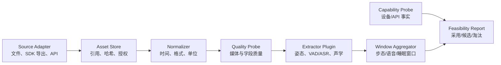

# 信息侧模块详细技术路线

状态：Implementation Baseline v0.3

更新时间：2026-07-22

适用里程碑：V1-M1～V1-R1

## 1. 目标和完成定义

信息侧负责回答三个问题：

1. 两台设备事实上开放了哪些数据和操作？
2. 原始媒体与设备记录是否具备足够质量，可供候选模型处理？
3. 每个模型输出能否在固定输入上稳定复现，并转换为统一 FeatureEvent？

V1 信息侧完成不等于“风险系统完成”。它的交付是可审计的数据证据：

- 设备能力探测结果。
- 原始输入的摘要、哈希和隐私等级。
- 标准化 Observation。
- 媒体/字段质量报告。
- 候选提取器的版本、速度和 FeatureEvent。
- 一次运行的 RunManifest 与错误记录。

## 2. 证据等级

所有设备与数据能力必须标注证据等级：

| 等级 | 名称 | 含义 | 可否写入比赛“已实现” |
|---|---|---|---|
| E0 | 需求/文档声明 | 来自方案、产品页或接口文档，尚未在本账号验证 | 否 |
| E1 | Synthetic Fixture | 人工构造的接口形状，只用于开发和测试 | 否 |
| E2 | Recorded Export | 来自真实设备或 SDK 的脱敏导出，尚未重复调用 | 只能写“已获得样例” |
| E3 | Live Verified | 使用比赛账号和目标设备成功调用，并保存脱敏证据 | 可以 |
| E4 | Repeatable Verified | 多次、跨时间或跨场景成功，且有成功率/缺失率 | 可以作为稳定能力 |

Mock 和 Fixture 永远不能自动晋级。晋级必须由 Review 记录证据路径、调用时间和结论。

## 3. 总体数据流



设备能力探测与媒体模型处理并行，但不能互相替代：

- 设备 API 未接通时，可以用录制文件探索模型。
- 模型在公开数据表现良好，不能证明目标设备视频质量足够。
- 产品页列出某项硬件参数，不能证明开发账号能取得对应字段。

## 4. 代码模块

```text
src/kangshield/information/
├── contracts.py          # SourceAsset、Observation、FeatureEvent、RunManifest
├── artifacts.py          # 运行目录、原子写入、JSONL、代码版本
├── privacy.py            # 内容摘要、稳定引用和结构脱敏
├── media_probe.py        # 文件、WAV、OpenCV 视频事实与质量探测
├── sleep_profile.py      # JSON/CSV 字段发现与映射候选
├── ezviz_snapshot.py     # SDK/API 脱敏快照分析与证据分级
├── extractor.py          # 通用模型插件 Protocol
├── streaming.py          # OpenCV 时间戳回放、PCM WAV 读取/重采样
├── pose_backend.py       # YOLO26n-pose + ByteTrack 适配器
├── speech_backend.py     # FunASR VAD/ASR/标点和词面标签
├── multimodal_pipeline.py # 特征落盘、时间窗对齐和性能报告
├── dataset_preparation.py # 公开固定源校验、媒体转换、case/lock
├── dataset_benchmark.py   # 多 case 调度、标签/CER 和覆盖率汇总
└── cli.py                # V1 命令行入口
```

边界规则：

- contracts 不依赖设备 SDK 或模型框架。
- adapters 不输出风险，只输出 SourceAsset/Observation/ProbeReport。
- 模型插件不直接读其他模块目录，由调用方传入 Observation。
- artifacts 是唯一允许写运行目录的模块。
- 原始媒体默认只引用，不复制；显式指定后才进入受控 artifacts。

## 5. 公共契约

### 5.1 SourceAsset

记录原始输入事实：

| 字段 | 含义 |
|---|---|
| schema_version | 契约版本 |
| asset_id | 由内容哈希派生的稳定 ID |
| modality | video/audio/sleep/device_snapshot |
| source_type | local_file/sdk_export/api_response/fixture |
| evidence_level | E0～E4 |
| uri | 本地或受控对象引用 |
| sha256 | 内容校验摘要 |
| byte_size | 文件大小 |
| captured_start_at/end_at | 设备事件时间；未知时为空 |
| ingested_at | 系统接收时间 |
| privacy_level | raw_sensitive/derived_sensitive/aggregate |
| metadata | 不含密钥和真实序列号的技术元数据 |

mtime 只能描述本地文件时间，不能冒充 captured_at。

### 5.2 Observation

记录一次可处理的标准观测：

- observation_id、asset_id、elder_ref、device_ref。
- modality、time_range、sequence。
- quality_status：pass/partial/fail/unknown。
- quality_metrics：亮度、模糊、采样率、字段完整率等。
- missing_reasons：无音轨、无法解码、接口未开放等。
- payload_ref：派生数据引用。

elder_ref 和 device_ref 使用项目内部引用或单向摘要，公共产物不保存姓名和设备序列号。

### 5.3 FeatureEvent

模型派生信息统一为：

- feature_id、observation_id、feature_type。
- start_at/end_at 或媒体相对 start_ms/end_ms。
- value、unit、confidence、quality。
- extractor_name、extractor_version、model_digest。
- source_feature_refs 与 limitations。

limitations 是正式字段。例如：

- uncalibrated_image_coordinate
- face_too_small
- missing_left_ankle
- far_field_audio
- synthetic_input

### 5.4 RunManifest

一次运行必须记录：

- run_id、stage、status。
- started_at、finished_at。
- code_version 与 dirty 状态。
- 配置摘要和输入摘要。
- 步骤列表、成功/失败、耗时。
- 产物相对路径。
- issues 与 evidence_level。

任何报告都应能反查到 RunManifest。

## 6. 运行目录与写入规则

```text
runs/<run_id>/
├── manifest.json
├── source_assets.jsonl
├── observations.jsonl
├── features.jsonl
├── multimodal_windows.jsonl
├── reports/
│   ├── media_probe.json
│   ├── sleep_field_profile.json
│   ├── ezviz_capability_snapshot.json
│   └── multimodal-pipeline-report.json
├── logs/
│   └── events.jsonl
└── artifacts/
```

规则：

1. JSON 文件采用临时文件 + rename 原子替换。
2. JSONL 每行一个完整对象，写入后可逐行恢复。
3. manifest 最后写入完成状态；异常退出保留 running/failed 证据。
4. 默认不把原始媒体复制进 runs。
5. reports 不保存 accessToken、AppKey、验证码、设备序列号或真实姓名。
6. runs 默认被 Git 忽略。

## 7. 三条初始开发路径

### 7.1 媒体探测

命令目标：

```text
kangshield-info probe-media <file> [<file> ...]
```

首版能力：

- 文件大小、MIME、SHA-256。
- WAV 声道、采样率、位深、帧数和时长。
- 可选 OpenCV 视频宽高、FPS、帧数、时长、FourCC。
- 抽样帧亮度、暗帧比例和拉普拉斯模糊度。
- 明确记录 OpenCV 不检查音轨，音频存在性仍需 ffprobe/SDK 证据。

### 7.2 睡眠导出字段发现

命令目标：

```text
kangshield-info profile-sleep <json-or-csv>
```

首版不假定 CS-EP-SDNL1 的字段名，而是：

- 展平字段路径。
- 统计类型、非空数和记录数。
- 根据字段名给出 heart_rate、respiratory_rate、presence、sleep_start 等“映射候选”。
- 候选不自动转为标准指标，必须人工确认单位和语义。
- 对 token、serial、name、phone、id 等字段只记录存在性，不记录值。

### 7.3 萤石 SDK/API 快照分析

命令目标：

```text
kangshield-info inspect-ezviz <sanitized-json> --evidence-level E1|E2|E3
```

首版选择“快照导入”而不是硬编码旧 REST 路径，原因是：

- 萤石当前文档中心和 SDK 版本并存。
- 具体能力必须查询目标设备能力集。
- 睡眠仪可能通过专用接口、组件或人工导出提供数据。

快照分析输出：

- 发现的设备数量和型号。
- 在线/离线字段。
- capability/support 类字段清单。
- 目标型号是否出现。
- 脱敏后的原始结构。
- 尚未验证的直播、回放、抓图、告警、音频和睡眠字段检查项。

后续获得确认过的接口文档后，再实现 LiveTransport；不让不确定接口固化到核心契约。

### 7.4 视频 + 语言多模态回放

```text
kangshield-info run-multimodal <video> <pcm-wav>
```

首版把两路文件视为共享零时刻的流式回放：视频按可配置 FPS 抽取时间戳帧，音频转为单声道 16 kHz，经姿态跟踪和 VAD/中文 ASR 后汇入固定毫秒窗口。输出完整 ModelBinding、FeatureEvent、MultimodalWindow 以及 warm/cold 两套性能口径。

实现、命令、模型决策和限制见 [V1 视频与语言多模态 Pipeline](v1-multimodal-pipeline.md)。

### 7.5 公开数据固定集评测

```text
kangshield-info benchmark-dataset <benchmark-cases.json>
```

V1-M2b 使用固定 SHA-256 的 URFD/FLEURS 子集验证多样本处理。每个 case 独立运行姿态、跟踪、VAD/ASR 和窗口 Pipeline，再按 URFD 帧阶段标签统计视频覆盖率、按 FLEURS 参考转写统计 corpus CER。两路数据不是自然同步录制，融合窗口只有工程验证含义，结果固定为 E1。数据来源、许可证、准备过程和完整指标口径见 [V1-M2b 数据集评测设计](v1-m2b-public-dataset-benchmark.md)。

## 8. 模型接入路线

模型按“先输入可用性，再输出精度”推进：

### 阶段 A：无模型质量探测

- 视频：解码成功率、FPS 稳定性、亮度、模糊、人体像素高度。
- 音频：音轨存在、采样率、有效语音比例、噪声。
- 睡眠：字段完整率、时间连续性、延迟。

### 阶段 B：基础提取器

- 已验证基线：YOLO26n-pose + ByteTrack。
- 已验证基线：FunASR FSMN-VAD + Paraformer-zh + CT-Punc。
- 待对比：MediaPipe Pose Landmarker。
- 睡眠字段映射。

### 阶段 C：候选增强

- MMPose/RTMPose。
- openSMILE eGeMAPS。
- Face Landmarker/OpenFace 可用性。
- YAMNet 环境声音。

### 阶段 D：V2 晋级

仅晋级满足以下条件的提取器：

- 固定样本可复现。
- 目标设备数据覆盖率合格。
- 速度、显存和许可证已记录。
- 错误案例和限制可解释。
- 能支撑跌倒主线或明确的增强演示。

当前模型只冻结为 V1 baseline。YOLO 的 AGPL/Enterprise 路线、RTMPose 替代方案和目标设备固定样本精度必须在 V1-R1 前完成，不能把“链路跑通”当成 V2 晋级。

## 9. 时间与多模态对齐

统一保存三类时间：

1. device/event time：设备或文件内时间。
2. received time：系统获得数据的时间。
3. media offset：相对媒体起点的毫秒偏移。

对齐规则：

- 不用本地文件 mtime 代替设备事件时间。
- 视频帧与音频段优先使用同一容器时间基。
- 睡眠日级报告保留 report_date 和生成时间，不伪造实时 timestamp。
- 发现时钟偏差时记录 clock_offset_ms 和估计方法。
- V1 目标是测量偏差，不预先承诺 ≤1 秒。

## 10. 错误与缺失语义

错误分四类：

| 类别 | 示例 | 处理 |
|---|---|---|
| source_unavailable | 设备离线、文件不存在 | 本次步骤失败，其他模态继续 |
| permission_denied | 无直播/回放权限 | 标记能力 blocked，不回退为“无数据” |
| decode_failed | 编码不支持、文件损坏 | 保存媒体事实和错误，不生成伪特征 |
| quality_insufficient | 夜视过暗、人体过小、音频噪声高 | Observation=partial/fail，由下游跳过 |

“设备离线”“权限不足”“模型未检出”“老人状态正常”必须是不同状态。

## 11. 隐私与安全

- 密钥只从环境变量或本机密钥文件读取，文件不进入 Git。
- 设备序列号在报告中转为带项目盐的不可逆 device_ref。
- 原始媒体保留在明确的受控目录，runs 只引用。
- 语音只在主动开启、同意和受控测试下处理。
- FeatureEvent 不保留完整语音文本时，应保留脱敏文本或关键词类别。
- Fixture 必须包含 synthetic 标记。
- 差分隐私在 V1 只做设计评估；没有明确机制、敏感度和效用测试时不得声称已实现。

## 12. V1-M1 验收

代码验收：

- probe-media 可对 WAV 和普通文件生成完整运行目录。
- OpenCV 可用时可对视频生成基本探测结果。
- profile-sleep 可发现任意 JSON/CSV 字段且不泄露敏感值。
- inspect-ezviz 可分析脱敏 Fixture/导出并保留证据等级。
- 自动化测试覆盖契约、运行产物、三条命令和脱敏。

真实设备验收仍需：

- C6c 真实能力集和一段含/不含音频结论明确的媒体。
- CS-EP-SDNL1 一份真实 API 响应或导出。
- 两项证据至少达到 E2；比赛已实现能力必须达到 E3。

## 13. 官方依据

- 萤石 [Android SDK 说明](https://open.ys7.com/doc/zh/book/4.x/android-sdk.html)列出了设备列表、预览、回放、录像、抓图和告警等通用能力，并要求依据设备能力集调用。
- 萤石 [EZOpenSDK API](https://open.ys7.com/doc/zh/android/com/videogo/openapi/EZOpenSDK.html)提供 getDeviceList、getDeviceInfo、captureCamera、getAlarmList 等接口。
- CS-EP-SDNL1 的公开硬件参数见[萤石官方商品页](https://www.ys7.com/item/994492.html)；开放 API 字段仍需真实账号验证。
- 模型候选和指标依据见 [V1 信息采集与模型探索](v1-information-acquisition.md)。
- 当前模型基线与官方模型卡见 [V1 视频与语言多模态 Pipeline](v1-multimodal-pipeline.md)。
