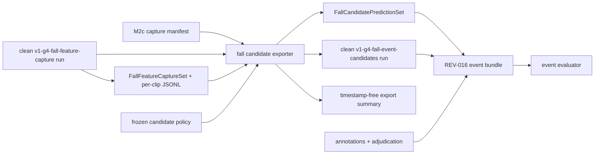

# V1-R1 G4 Capture Feature 到 Candidate 的导出桥接

状态：Implemented for E1 contract validation；真实 C6c feature producer 与事件证据仍 Open

基准日期：2026-07-23

关联输入：[M2c 采集包就绪门](v1-m2c-capture-readiness-gate.md)、[G4 跌倒运动特征](v1-g4-fall-motion-features.md)、[Candidate Episode 策略](v1-g4-fall-event-candidates.md)、[事件评估就绪门](v1-g4-event-evaluation-readiness.md)

## 1. 目标与非目标

REV-016 已有严格事件 scorer，REV-017 已冻结 label-blind candidate 状态机，但两者之间原先没有生产接口：公开压力 runner 只能读取 URFD/CAUCAFall 专用父子 run，C6c 特征到位后仍需人工拼 prediction JSON 和 source manifest。

本桥接把该缺口变成版本化契约：一个 capture-bound G4 feature run 输出逐 clip frame stream 和索引；导出器校验完整来源链，执行冻结状态机，再生成事件 evaluator 可直接读取的 prediction/source run。它不负责：

- 从视频运行姿态模型或提取 G4 frame feature；
- 读取 annotation、adjudication 或任何动作标签；
- 组装或修改人工标注；
- 计算风险、告警或最终模型决定。

## 2. 数据流与信任边界



导出器只从 capture manifest 读取 `M2cEventContext` 暴露的安全事实：capture digest/ref、fixture 状态、held-out 时间、variant/model-policy 摘要以及 scenario ID/duration。它不会把 participant/operator、媒体路径、动作窗口或设备标识复制到下游报告。

## 3. 上游公开契约

### 3.1 `FallFeatureCaptureSet`

一份 feature set 只绑定一个姿态 variant，核心字段为：

| 字段 | 约束 |
|---|---|
| `feature_set_id` / `source_run_id` | source run 唯一绑定 |
| `fixture` / `evidence_level` | fixture 只能 E1；真实本地文件最多 E2 |
| capture/model/fall-feature SHA-256 | 必须分别匹配 capture 与 candidate policy |
| `feature_version` | 必须等于 candidate policy 的输入版本 |
| `generated_at` | 有时区且位于 source run 开始/结束之间 |
| `labels_read_during_generation` | Literal false |
| `clips` | 与 capture scenario 顺序、数量和 duration 完全一致 |

每个 `FallFeatureClipStream` 保存 opaque observation ID、以 source-run 根目录为基准的规范化相对路径、SHA-256、字节数和 frame 数。绝对路径、反斜杠、空段、`.`、`..` 和越界 symlink 均拒绝。

### 3.2 Feature source run

上游 manifest 的 stage 固定为 `v1-g4-fall-feature-capture`。它必须 completed、代码版本已知、evidence 一致、无 error；正式导出默认还要求 clean。configuration 必须绑定：

- variant、capture manifest、model policy、fall-feature policy；
- feature-set SHA-256 与 feature version；
- `labels_read_during_generation=false`；
- `risk_assessment_emitted=false`、`alert_emitted=false`。

feature set 和全部 clip JSONL 必须列入该 manifest 的 artifacts。run 开始时间不得早于 frozen labels 或 `first_inference_at`。

### 3.3 Frame stream

每一非空行必须是 `video.fall_motion_frame` 的 `FeatureEvent`，且：

- observation ID 与 clip index 一致，feature ID 在 clip 内唯一；
- `FallMotionFrameValue.feature_version`、extractor version、time-range start 和 frame timestamp 一致；
- frame window 位于 clip duration 内；
- privacy 固定为 `derived_sensitive`；
- frame 数与 index 一致；
- 时间戳、sequence、尺寸、track/gap 和 risk/alert 条件继续由冻结状态机 fail closed。

流内夹入其他 feature type、摘要/字节数漂移或未知字段都会在创建下游 run 前失败。

## 4. Candidate 输出契约

`export-fall-candidates` 对每个 clip 调用 REV-017 的 `generate_fall_candidate_episodes`。case ref 仅由 capture opaque ref、variant 和 scenario ID 构造，不使用路径或标签。

### 4.1 `FallCandidatePredictionSet`

REV-016 原先的私有 prediction schema 已提升为公共契约，字段与 scorer 输入保持不变：

- prediction/source run ID；
- capture、model、fall-feature 和 candidate-policy SHA-256；
- 有时区的 `generated_at`；
- 每个 capture clip 的 duration 与去重 candidate episode。

episode 的 start/detected/end 和 candidate ID 属于 derived-sensitive evaluator 输入，不进入公开汇总。

### 4.2 Candidate source run

输出 stage 固定为 `v1-g4-fall-event-candidates`。manifest configuration 包含 REV-016 严格校验的六项：variant、capture、model、fall-feature、candidate-policy 和 `candidate_events_sha256`；同时补充上游 feature run/set 摘要、label-access 与 Risk/Alert false。prediction 在 run 内生成，最终 finished time 晚于其 `generated_at`。

### 4.3 `FallCandidateExportSummary`

公开 summary 只保存 variant、opaque capture ref、策略/上游/输出摘要、clip/frame/activated/episode/trigger-path 计数和限制。它不包含：

- 任何时间戳或 candidate 窗口；
- candidate/observation/track ID；
- 本地路径、bbox、keypoints 或标签；
- RiskAssessment 或 Alert。

## 5. Fixture 与真实策略

既有 scorer-only fixture policy 可以完全不含规则，只用于验证手写 TP/FP/FN 公式；它仍不能运行 candidate generator。新增 rule-bearing fixture 必须同时包含 transition、settled 和 state-machine 三组规则，且保持 `fixture=true`、`review_status=fixture_only`。这允许端到端测试真实状态机和导出接口，又不会把 synthetic frame layout 声称为模型性能。

非 fixture 策略仍必须为 `e1_exploratory_frozen`。公开压力命令默认拒绝 fixture policy，只有 capture export 的明确 fixture 路线会加载 rule-bearing fixture。

## 6. 命令与 E1 端到端回归

单 variant 导出：

```bash
kangshield-info export-fall-candidates \
  data/raw/v1-m2c/<capture_id>/capture-manifest.json \
  runs/<feature-run>/reports/fall-feature-capture-set.json \
  runs/<feature-run>/manifest.json \
  --policy configs/v1-g4-event-candidate-policy.json \
  --evidence-level E2
```

正式输入默认拒绝 dirty source。`--allow-dirty-source` 只用于本地排错，不能进入事件 provenance gate。

完整 E1 bridge fixture：

```bash
make PYTHON=.venv/bin/python prepare-g4-candidate-export-fixture
make PYTHON=.venv/bin/python assess-g4-candidate-export-fixture
```

该 fixture 为三 variant 创建 capture-bound feature source，真实执行 frozen state machine 和 exporter，再把三个 prediction/source run 放入 REV-016 bundle。synthetic activation layout 只验证接口和计数，不代表姿态推理、C6c recall 或误触发率。若当前工作树 dirty，evaluator 会如实关闭 provenance gate；干净提交上的正式 fixture 才能得到 `tooling_only`。

## 7. 真实 C6c 执行顺序

1. 取得通过 REV-014 camera gate 的冻结 capture，并先完成独立标注与裁决。
2. 对三个 frozen pose variant 分别运行通用 `v1-g4-fall-feature-capture` producer，生成 feature set 和逐 clip JSONL；该 producer 是下一实现切片。
3. 对每个 variant 原样执行 candidate policy SHA-256 `380151c86ddaf6b79328ca516a778111fe8a7b2c2caa61e209a055bc8942dd08`。
4. 将三个 exporter prediction/source run 与 capture readiness、annotation、adjudication 组装为 REV-016 bundle。
5. 运行事件 evaluator；先 Review provenance/标注门，再解释 TP/FP/FN、曝光和 delay。

禁止用该 held-out capture 调整 feature/candidate 阈值后继续报告同一批指标。任何语义修改必须升级 policy/version，并换独立开发/验证分区。

## 8. 当前完成与剩余门

本切片完成：公共 feature/prediction/summary 契约、严格 provenance、CLI、三 variant rule-bearing fixture、evaluator 直接消费、摘要篡改拒绝和自动化回归。

仍未完成：真实 capture G4 feature producer、C6c E2 数据、三路 clean feature run、真实 bundle 组装、人工标注责任与事件指标、多人物 candidate 归属、最终姿态许可证以及 RiskAssessment/Alert。V1-R1 因此继续保持 In progress。
