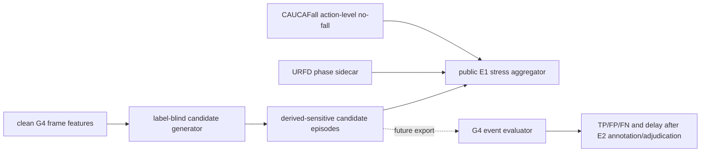

# V1-R1 G4 跌倒候选 episode 设计

## 1. 目标与边界

本子门把既有 `video.fall_motion_frame` 转换为可去重、可交给事件 scorer 的 `video.fall_candidate_episode`。它解决的是候选生成链路与 episode 语义，不是跌倒诊断、风险分级或告警。

本策略在查看未来 C6c held-out 候选输出前冻结。首轮只复用已经生成的 URFD 与 CAUCAFall G4 特征做 E1 开发压力；这些公开数据已经参与 V1 开发，因此结果不能解释为独立泛化、目标老人准确率或目标摄像头性能。

硬边界：

- 生成器只接收 `FallMotionFrameValue`，API 不接收数据集标签或 annotation。
- 标签只在 episode 全部生成后进入压力评测器。
- 输出固定 `risk_assessment_emitted=false`、`alert_emitted=false`。
- 当前仍是 `largest_bbox` 单主目标；track ID 只用于状态重置，不进入候选值或父报告。
- 本轮不计算 precision、recall 或 F1。URFD 姿态阶段和 CAUCAFall action-level no-fall 标签都不是裁决后的事件真值。

## 2. 链路位置



候选生成与事件评分继续分离。`event_evaluation.py` 不运行本策略，只校验外部 candidate-policy 摘要；后续 C6c 三路预测必须绑定同一 policy digest。

## 3. 冻结策略

策略文件为 `configs/v1-g4-event-candidate-policy.json`，policy ID 为 `v1-g4-event-candidate-policy-v0.1.0`。它绑定 G4 feature policy SHA-256 `3bedf218e9e413c1ab168134b8333db5cdebf764d5f8c9ece65ba212ea9d5eda`。

| 规则 | 冻结值 | 语义 |
|---|---:|---|
| transition 横卧持续 | 600 ms | bbox-horizontal 至少连续 600 ms |
| rapid-descent lookback | 1500 ms | 同 track 在确认点之前 1.5 s 内出现过下降代理 |
| transition 低运动 | 不要求 | 跌倒过渡阶段不因 stationarity 历史碎片而被强制关闭 |
| settled 横卧持续 | 1200 ms | 缺少下降证据时的较慢兜底 |
| settled 低运动 | 必须 | 兜底还需当前 low-motion proxy |
| 最大输入帧间隔 | 450 ms | 超过后清除身份和下降历史 |
| release grace | 600 ms | 最后一个横卧证据后延迟闭合 episode |
| refractory | 3000 ms | episode 闭合后抑制重复候选 |

规则不是网格搜索最优值。它根据既有 G4 时间窗、状态机可解释性和未来流式实现边界选择，并在查看 C6c held-out 输出前固定；如果调整任一阈值、路径优先级、回溯起点、闭合或 refractory 语义，必须升级 policy/version 并全量重跑。

## 4. 状态机语义

每个 clip 只有一个当前 `largest_bbox` 主 track 状态：

1. 输入时间戳和 frame sequence 必须严格递增，尺寸和 feature version 在 clip 内固定。
2. track 缺失、track 变化或帧间隔超过 450 ms 时，清除 rapid-descent 历史；活动 episode 按最后横卧证据加 release grace 闭合。
3. 每帧先裁剪 1.5 s 之外的下降历史，再登记当前 rapid-descent 代理。
4. transition 路径优先：横卧持续达到 600 ms 且 lookback 内有下降代理时触发；episode 起点回溯到最早仍在窗口内的下降帧，`detected_at` 为首次满足规则的帧。
5. transition 未满足时检查 settled 路径：横卧持续达到 1200 ms 且 low-motion 为 true；起点按当前 `horizontal_duration_ms` 回填。
6. 活动 episode 内的新代理只延长它，不产生第二个 candidate；横卧证据消失超过 600 ms 后闭合，再进入 3 s refractory。
7. 每个 episode 保存 `start_ms`、`detected_at_ms`、`end_ms` 和 trigger path，但不保存 track ID、bbox 或关键点。

精确 episode 窗口只存在于被 Git 忽略的 derived-sensitive `features.jsonl`。父报告只发布 case 计数、路径计数与 transition-onset delay 摘要。

## 5. 契约

`FallEventCandidatePolicy` 同时兼容既有 synthetic fixture policy 与本轮非 fixture 策略：

- fixture 必须保持 `review_status=fixture_only`，可以不含真实规则；
- 非 fixture 必须为 `e1_exploratory_frozen`，且 transition、settled、state-machine 三组规则完整；
- 生成阶段固定 `source_label_access=forbidden_during_generation`。

`FallEventCandidateEpisode` 是 derived-sensitive 工具产物，包含候选版本、opaque candidate ID、三个相对时间、trigger path 和两个 Literal false。

公开压力父报告使用三层摘要：

- `FallCandidateCaseStressEvaluation`：case、标签口径、曝光时长、输入帧数、episode/trigger 计数、是否激活和可选 onset delay；
- `FallCandidateVariantStressReport`：URFD fall 激活覆盖、URFD ADL/CAUCAFall negative activation、negative episode/hour 与 delay 摘要；
- `FallCandidatePublicStressReport`：三变体、策略/来源摘要和证据限制。

父报告不保存候选绝对窗口、candidate ID、track ID、bbox、keypoints 或本地路径。

## 6. 来源与 fail-closed 校验

### 6.1 URFD

每个姿态 variant 必须提供一个独立的 `v1-g4-fall-feature-benchmark` run：

- manifest 必须 completed、E1、clean、无 error issue，stage/run ID 与目录一致；
- report、manifest configuration、feature version 和 G4 policy digest 必须一致；
- 六个 case 的 ID/order、video sequence/class 与当前 benchmark-cases 必须一致；
- parent `features.jsonl` 必须能按来源 observation 精确分成六组，且每组数量等于 case report；
- 每条 fall frame 必须 derived-sensitive、时间一致、无 risk/alert。

### 6.2 CAUCAFall

父 run 必须为 clean/completed/E1 的 `v1-g4-fall-adl-negative-benchmark`，并保持三 variant 固定顺序。其引用的 36 个 child run 逐个验证：

- child stage 为 `v1-g4-fall-adl-negative-case`，代码版本与父 run 一致；
- child report 必须逐字段等于父报告中的 case 摘要；
- case/variant/video digest 和风险/告警配置必须一致；
- fall feature 数量必须等于 `sampled_frames`，最大 time-range end 必须等于已报告曝光时长。

所有输入作为摘要化 SourceAsset 登记；manifest/report/features 或 annotation 任一漂移都会 fail closed。

## 7. E1 压测口径

固定输入为三种姿态 variant：

- URFD：3 个 simulated-fall clip + 3 个 ADL clip；
- CAUCAFall：12 个 action-level no-fall clip，覆盖拾物、坐下、跪地、行走和三档光照；
- 总计 18 case/variant、54 个 variant/case evaluation。

生成器先在完全不读取 sidecar 的情况下生成全部 episode；之后评测器才读取标签：

- URFD fall 只报告 3 个 clip 中有多少产生候选，并以 coarse `falling_transition` 首帧计算描述性 detection delay；
- URFD ADL 与 CAUCAFall 只报告 activated clip、negative episode 和按总 negative exposure 计算的 episodes/hour；
- 不做模型排名，不把 0 candidate 解释为低误报模型，也不把 3/3 解释为高召回模型。

Keypoint R-CNN 即使在该开发集上表现较好，也仍是 fallback：lying keypoint gate 与模型权重分发门不会被本结果覆盖。RTMPose/HumanArt 的 artifact license 仍保持 fail closed。

## 8. 运行

已有 G4 feature runs 时，本步骤不需要 GPU：

```bash
kangshield-info benchmark-fall-candidates \
  --urfd-run runs/<clean-yolo-fall-feature-run> \
  --urfd-run runs/<clean-rtmpose-fall-feature-run> \
  --urfd-run runs/<clean-keypointrcnn-fall-feature-run> \
  --caucafall-run runs/<clean-three-variant-adl-parent> \
  --benchmark-cases data/processed/v1-m2b/benchmark-cases.json
```

也可设置 Makefile 中四个 `KANG_G4_*_RUN` 变量后执行：

```bash
make PYTHON=.venv/bin/python benchmark-g4-fall-candidates
```

默认拒绝 dirty source。`--allow-dirty-source` 只用于开发排错，不能形成正式证据。

## 9. 验收与下一门

本子门完成条件：

- 策略文件、digest、触发/回溯/闭合/refractory 语义冻结；
- 状态机、边界重置、去重、来源门与隐私契约有自动化测试；
- 三变体 54 项公开压力在 clean commit 上 completed/E1；
- 正式报告如实记录漏候选和负样本候选，不以开发集选择最终模型；
- 风险与告警始终为 false。

它不会关闭以下 V1-R1 门：C6c E2 正负/床上躺卧/空场持续、多人物身份策略、双人标注与裁决、真实事件指标、最终模型许可证和 RiskAssessment/Alert 设计。下一步是在不修改本 policy 的前提下，从 C6c clean feature run 导出三路 candidate stream，再交给既有事件 evaluator。

正式 E1 结果见[跌倒候选 episode 公开压力报告](reports/v1-g4-fall-candidate-public-stress.md)。
