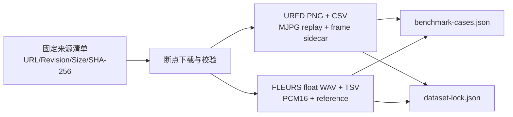

# V1-M2b 公开真实场景固定集与对齐评测

状态：Implementation Baseline v0.1

更新时间：2026-07-22

## 1. 目标与边界

V1-M2b 把 V1-M2a 的单个公开 smoke 扩展为可重复的固定样本套件，回答：

1. 姿态、跟踪、VAD、中文 ASR 和固定窗口能否连续处理多个真实人物录制。
2. 视频逐帧标签和中文参考转写能否进入同一可审计评测报告。
3. 模型覆盖率、字符错误率、耗时和失败样本能否按固定口径比较。

本里程碑不等待萤石设备权限，但也不把公开数据写成目标设备证据。公开视频与公开语音来自不同录制，只进行工程上的共同零时刻配对；融合窗口用于验证契约和时间流，不用于评价自然音视频语义。所有结果固定为 E1。

目标设备 C6c 音视频时间基、CS-EP-SDNL1 字段和受控居家样本单列为 V1-M2c，继续要求 E2/E3 证据。

## 2. 数据集选择

### 2.1 视频：UR Fall Detection Dataset

[URFD 官方页面](https://fenix.ur.edu.pl/~mkepski/ds/uf.html)提供 30 段模拟跌倒和 40 段日常活动序列、逐序列 RGB 帧、同步时间 CSV 与帧级姿态阶段标签。V1-M2b 固定使用 camera 0 的六段：

| 序列 | 类别 | RGB 帧数 | 用途 |
|---|---:|---:|---|
| fall-01 | 模拟跌倒 | 160 | 跌倒阶段覆盖率 |
| fall-02 | 模拟跌倒 | 110 | 跌倒阶段覆盖率 |
| fall-03 | 模拟跌倒 | 215 | 跌倒阶段覆盖率 |
| adl-01 | 日常活动 | 150 | 非跌倒人物覆盖率 |
| adl-02 | 日常活动 | 180 | 非跌倒人物覆盖率 |
| adl-03 | 日常活动 | 180 | 非跌倒人物覆盖率 |

帧标签只解释为 `-1=not_lying`、`0=falling_transition`、`1=lying`。它们用于分阶段统计姿态可见性，不等于跌倒分类器真值；当前也没有据此计算 precision、recall 或 F1。

URFD 采用 CC-BY-NC-SA-4.0。准备命令必须显式确认非商业许可证；仓库不分发原始数据。比赛材料若包含样本截图、派生视频或再分发产物，必须另做署名、相同方式共享和用途审查。

### 2.2 语言：Google FLEURS 普通话

[FLEURS 官方研究页](https://research.google/pubs/fleurs-few-shot-learning-evaluation-of-universal-representations-of-speech/)描述了覆盖 102 种语言、每种约 12 小时的语音基准；本项目使用 [Hugging Face 上的官方数据仓库](https://huggingface.co/datasets/google/fleurs)中 `cmn_hans_cn/dev` 的固定 revision。选取三条女性、三条男性语音，每条句子不同：

| Case | URFD | FLEURS WAV | 性别 | 时长 |
|---|---|---|---|---:|
| fall-01-fleurs-f01 | fall-01 | 15119654797764315030.wav | female | 4.92 s |
| fall-02-fleurs-m01 | fall-02 | 8462371175358088591.wav | male | 8.88 s |
| fall-03-fleurs-f02 | fall-03 | 6493646763526361467.wav | female | 4.02 s |
| adl-01-fleurs-f03 | adl-01 | 7967524639119264013.wav | female | 5.10 s |
| adl-02-fleurs-m02 | adl-02 | 18273624111539703900.wav | male | 8.52 s |
| adl-03-fleurs-m03 | adl-03 | 7748726541994053870.wav | male | 7.74 s |

固定 revision、下载 URL、字节数和 SHA-256 位于 `configs/v1-m2b-datasets.json`。FLEURS 为 CC-BY-4.0，仍需署名。源 WAV 是 16 kHz 单声道 IEEE float；准备器统一转成现有回放器支持的 16 kHz、单声道、PCM16，并在 `dataset-lock.json` 记录派生摘要。

## 3. 配对与证据语义

每个 case 的 `pairing_kind` 强制为：

```text
cross_dataset_synthetic_common_zero
```

含义是：

- 视频和语言分别是真实人物录制，不是合成画面或合成语音。
- 二者不是同一时间、地点或人物的自然同步录制。
- Pipeline 只把两个文件的起点设为共同零时刻，测试窗口聚合和模态缺失表达。
- 视频指标只对 URFD 标签负责，ASR 指标只对 FLEURS 参考转写负责。
- 结果不能证明 C6c 的音视频同步、夜视、远场拾音或目标老人场景性能。

`benchmark-dataset` 不提供 `--evidence-level` 参数，避免操作者把该固定集手工提升为 E2/E3。

## 4. 数据准备 Pipeline



准备器执行以下校验：

1. 下载前读取固定 manifest；已有文件也重新核对大小与 SHA-256。
2. URFD PNG 按源帧号排序，以同步 CSV 的中位帧周期编码 MJPG replay。
3. sidecar 同时保存源时间、replay 时间、误差与姿态阶段标签，不隐藏恒帧率转换误差。
4. FLEURS 只从 tar 中读取白名单 basename，拒绝缺失或重复成员。
5. 核对性别、样本数、采样率，并统一为 PCM16。
6. 原始数据写入被 Git 忽略的 `data/raw`，派生固定集写入被忽略的 `data/processed`。

## 5. 批量评测模块

| 模块 | 职责 |
|---|---|
| `dataset_preparation.py` | 固定源校验、URFD 转换、FLEURS 提取/归一化、case 与 lock 生成 |
| `dataset_benchmark.py` | 多 case 调度、逐帧标签对齐、CER、覆盖率、分组汇总 |
| `DatasetBenchmarkCase` | 输入来源、配对语义、参考转写和限制 |
| `DatasetCaseEvaluation` | 单 case 姿态/跟踪、阶段、VAD、CER、窗口与性能 |
| `DatasetBenchmarkReport` | 六 case 加权汇总、模型绑定、环境、运行 ID 和限制 |

FunASR 在整套 benchmark 中只加载一次；YOLO pose 每段视频重新实例化，避免 ByteTrack 状态跨 case 泄漏。每个 case 有独立 child run，套件有独立 parent run。任何 case 失败都会保留 failed manifest，且整套 benchmark 不标记完成。

## 6. 指标口径

### 视频

- `pose_frame_coverage = 检出至少一人的抽样帧数 / 全部抽样帧数`。
- `pose_tracking_coverage = 含 track_id 的人物阳性帧数 / 人物阳性帧数`。
- `mean_pose_quality` 为 COCO-17 关键点置信度不低于 0.5 的比例均值。
- 阶段统计通过抽样时间戳就近匹配 replay sidecar；报告最大匹配误差。
- `mean_bbox_width_height_ratio` 仅作为画面姿态代理，不是跌倒分类输出。

### 语言

- 参考和识别文本先做 Unicode NFKC、casefold，并去掉空白和标点，只保留字母、数字和汉字。
- `CER = Levenshtein 编辑距离 / 参考字符数`。
- corpus CER 使用六条样本的总编辑距离除以总参考字符数，不对单句 CER 做简单平均。
- `speech_coverage` 先合并重叠 VAD 段，再除以 WAV 时长。
- 汇总报告只保存字符数、编辑距离和 CER；参考全文与识别全文不复制进汇总报告。

### 性能

- 套件记录共享语音模型加载时间、每 case pose 加载总时间、case processing 总时间和整套 wall time。
- 每个 child report 继续记录 processing RTF 和 GPU 峰值。
- 离线回放性能不等同于直播传输延迟。

## 7. 运行方式

首次准备约下载 0.65 GB：

```bash
source .venv/bin/activate
python scripts/prepare_v1_m2b_data.py \
  --accept-urfd-noncommercial-license
```

本地或交互 GPU：

```bash
kangshield-info benchmark-dataset \
  data/processed/v1-m2b/benchmark-cases.json \
  --pose-model models/yolo26n-pose.pt \
  --offline-models
```

Slurm L40：

```bash
make submit-m2b-benchmark
sacct -j <job_id> --format=JobID,State,ExitCode,Elapsed,NodeList
```

## 8. 验收门

V1-M2b 只有同时满足以下条件才可标记 Done：

- 固定来源清单包含 revision/URL、大小、SHA-256、许可证和六个 case。
- 数据准备可重复生成六段 replay、六段 PCM16 WAV、sidecar 和 lock。
- 自动化测试覆盖时间/标签转换、float WAV 归一化、文本标准化、CER 和 case 汇总。
- 干净提交在 Slurm L40 上完成六个 child run 和一个 parent run。
- 报告给出视频覆盖率、阶段覆盖率、corpus CER、性能与失败分析。
- Review 明确 E1 边界，并将目标设备验证保留在 V1-M2c。

达到本门只代表“公开真实录制固定集与评测链路完成”，不代表模型已晋级 V2，也不代表萤石设备接入完成。
