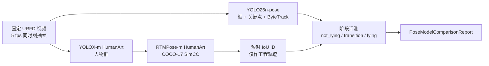

# V1-M3 姿态模型对比设计

状态：Accepted design v0.2

更新时间：2026-07-22

## 1. 目标

V1-M2b 已确认当前 YOLO26n-pose + ByteTrack 基线在六段 URFD 视频上的整体人物/姿态帧覆盖率为 89.41%，但 `lying` 阶段只有 9/21（42.86%）。V1-M3 第一轮只解决这个已定位的问题：在相同视频、相同抽帧时刻和相同阶段标签下，对比独立人体检测 + top-down 姿态链路能否提高横卧阶段可用性。

本轮不重复运行 ASR，不训练跌倒分类器，也不把公开数据结果写成 C6c 实机结论。

## 2. 固定候选

| Variant | 检测器 | 姿态模型 | 推理 | 输入 | 许可证记录 |
|---|---|---|---|---|---|
| `yolo26n-pose` | YOLO26n-pose 内置人体框 | YOLO26n-pose COCO-17 | PyTorch / Ultralytics | 640 | AGPL-3.0 或 Enterprise，V2 仍需决定 |
| `rtmpose-m-humanart` | YOLOX-m HumanArt | RTMPose-m HumanArt COCO-17 | ONNXRuntime | 640×640 / 192×256 | 实现为 Apache-2.0；Human-Art annotations 为 CC-BY-NC-SA-4.0/non-commercial，artifact 标记 review-required |

候选模型清单冻结在 `configs/v1-m3-pose-models.json`：

| 模型 | ZIP SHA-256 | ONNX SHA-256 |
|---|---|---|
| YOLOX-m HumanArt | `a000224fd8ba283202bc62d4a5fcdfe353adb9f468777dbac1ea2ada2093adde` | `3dea6513388889f0fff4b77bf7a26013600321b9eb9ceb0e9a400a82572f5f23` |
| RTMPose-m HumanArt | `e2b38e3a585d013eb2002259f8ca1b16543bf35ad499cf3b6ba4f2254294d8fe` | `12e1b9fcbcd867c3fb6d8f4d509cf1d8c5373df5e529676e32f6dd888758316c` |

完整 MMPose + MMCV 路线没有进入本轮运行环境。当前 Python 3.13 / Torch 2.13 / CUDA 13 栈无法直接取得严格匹配且包含 `mmcv._ext` 算子的 MMCV 构建；`mmcv-lite` 也不能满足 MMPose 导入的算子依赖。因此本轮采用 MMPose 项目提供的 ONNXRuntime 路线，在不引入 MMCV、MMEngine、MMPose 和 MMDetection 运行时依赖的情况下复用官方导出模型。

## 3. Pipeline



新后端输出既有 `PoseDetection`，因此后续实时/回放 Pipeline 不需要改变公共姿态字段。模型对比使用独立的视频-only runner，避免重复加载 FunASR，也避免把语言耗时混入姿态模型选择。

## 4. 阈值与追踪口径

- YOLO 基线保持 M2b 的 0.35 置信度与 ByteTrack 配置。
- YOLOX-m HumanArt 使用人物置信度 0.05。官方导出 `pipeline.json` 的后处理阈值是 0.01；0.05 是本轮工程预检后使用的保守值。
- 该 0.05 阈值在同一固定集上做过扫描，不属于 held-out 超参数；正式报告必须标记这一偏差，不能把提升写成独立测试集泛化结论。
- RTMPose 关键点保留原始 SimCC 分数，同时报告 `>=0.3` 和 `>=0.5` 的平均可见比例。
- 候选链路使用贪心 IoU 短时 ID；它与 ByteTrack 不是同一算法，因此 tracking coverage 只检查字段链路，不能作为两模型的主胜负指标。

## 5. 评测与验收口径

主指标：`by_posture_phase.lying.pose_frame_coverage`。

辅助指标：

1. 整体、fall、ADL 和各阶段的人物框/姿态帧覆盖率。
2. 平均检测置信度、平均关键点置信度。
3. 关键点 `>=0.3`、`>=0.5` 可见比例；特别检查 fall-01 横卧段。
4. 每 case 唯一 track 数与轨迹中断，但不跨 tracker 排名。
5. 模型加载、平均/P95/最大帧耗时、推理与回放实时系数。
6. Torch CUDA 峰值和进程 GPU 显存快照分别记录；ONNXRuntime 显存快照不冒充采样峰值。

候选只有同时满足以下条件，才进入 V2 候选而不是直接晋级：

- `lying` 覆盖率相对基线提高至少 20 个百分点。
- 改善不是只靠低置信度框；错误段的关键点质量必须单独 Review。
- L40 上达到实时回放要求。
- C6c 白天、夜视、遮挡和目标机位样本在 V1-M2c 复测通过。
- 模型、训练数据和比赛分发许可证审查通过。

## 6. 运行

准备并验证模型：

```bash
python -m pip install -e ".[dev,rtmpose-gpu]"
python scripts/prepare_v1_m3_pose_models.py
python scripts/prepare_v1_m3_pose_models.py --offline
```

本地 CPU 开发验证：

```bash
kangshield-info benchmark-pose-models \
  data/processed/v1-m2b/benchmark-cases.json \
  --yolo-device cpu \
  --rtmpose-device cpu
```

L40 正式运行：

```bash
make submit-m3-pose-comparison
```

输出包括父级 `pose-model-comparison-report.json`、每个 variant 汇总和 12 个独立 case run。模型、数据集媒体和 `runs/` 均不提交 Git。

## 7. 当前边界

- URFD 只有阶段标签，没有关键点真值，不能计算 AP、PCK 或 OKS。
- 固定集没有人物存在/不存在的负样本真值，不能由本轮计算检测误报率。
- 公开数据和阈值扫描都固定为 E1；不能替代 C6c E2/E3 设备证据。
- 人体框覆盖率不等于关键点几何正确。尤其 fall-01 即使返回框，也可能没有足够可信的髋、肩、踝点支持跌倒规则。
- 干净提交 `0674be9` 已由 Slurm job `1760` 在 L40 上完成；结果与决定见 [V1-M3 姿态模型同集对比报告](reports/v1-m3-pose-model-comparison.md)。
