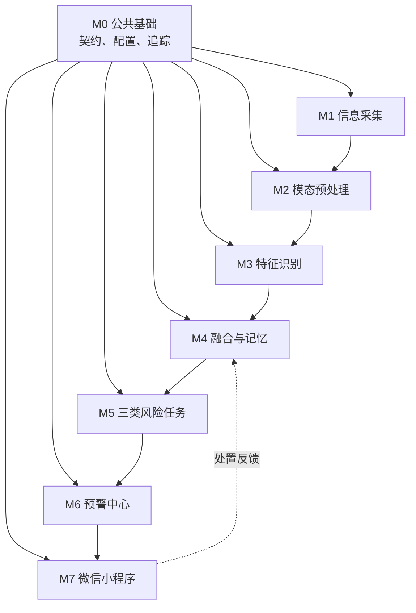
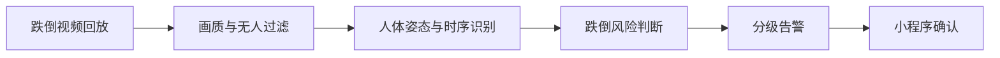
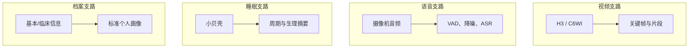

可以把“施工”设计成 8 个相互解耦的工程包，再按照 5 个批次推进。核心原则是：

> 接口先行、模块并行、纵向验收；每个模块都能使用模拟输入独立开发，不等待上游完成。

## 一、施工模块划分

| 工程包        | 主要职责                   | 标准输入                  | 标准输出                  |
| ---------- | ---------------------- | --------------------- | --------------------- |
| M0 公共基础    | 数据契约、用户/设备、鉴权、日志、追踪、配置 | —                     | 公共 SDK、Schema         |
| M1 信息采集    | 萤石设备接入、媒体获取、基本信息录入     | 设备流、人工输入              | `Observation`         |
| M2 模态预处理   | 抽帧、切片、降噪、过滤、睡眠数据清洗     | `Observation`         | `CleanObservation`    |
| M3 特征识别    | 视频、语音、睡眠、档案特征提取        | `CleanObservation`    | `FeatureEvent`        |
| M4 融合与长期记忆 | 时序对齐、个人基线、历史趋势、缺失处理    | `FeatureEvent`        | `RiskFeatureSnapshot` |
| M5 风险任务    | 跌倒、诈骗、心理健康独立判断         | `RiskFeatureSnapshot` | `RiskAssessment`      |
| M6 预警与处置   | 分级、去重、升级、通知、处置状态机      | `RiskAssessment`      | `AlertEvent`          |
| M7 交互输出    | 微信小程序、事件详情、反馈、周报       | `AlertEvent`          | `FeedbackEvent`       |

逻辑上模块充分解耦，但比赛原型阶段不必将每个子模块都做成微服务。建议保持清晰代码边界，部署为 5～7 个进程即可。

## 二、施工依赖关系



因为 M0 会同时提供模拟事件生成器，所以 M1～M7 不需要严格串行等待。例如小程序可以直接消费模拟 `AlertEvent` 开发。

## 三、按五个批次推进

### 第 0 批：冻结接口和工程骨架

这是所有并行开发的前提。

施工内容：

* 冻结六类核心数据契约
* 建立老人、设备、事件、风险、告警、反馈基础表
* 建立模拟事件生成器
* 统一 `elder_id`、`device_id`、`trace_id`
* 建立 Docker Compose、配置管理和结构化日志
* 定义模型版本、数据版本和幂等规则

本批不追求真实算法，先打通：

```text
模拟 Observation
→ 模拟 FeatureEvent
→ 模拟 RiskAssessment
→ AlertEvent
→ 小程序显示
→ FeedbackEvent
→ 数据库留痕
```

验收门：任何成员拉取工程后，可以一条命令启动并完成模拟闭环。

---

### 第 1 批：跌倒纵向闭环

优先构建最容易现场演示、价值最明确的一条完整链路。



施工内容：

* 视频文件/回放源接入
* 模糊、黑屏、无人帧过滤
* 人体检测、跟踪、姿态估计
* 快速下降、横卧、持续静止判断
* 跌倒候选事件
* 三级风险状态机
* 告警详情、视频证据、人工确认和误报反馈

验收门：

* 正常行走、坐下、弯腰、躺床、真实跌倒场景可以重复测试
* 单次事件全链路可追踪
* 小程序能够完成“收到告警—查看证据—确认处置”

这一批先使用录制视频，避免萤石接口权限拖慢算法和前后端施工。

---

### 第 2 批：真实设备接入与多模态采集

这一批按数据源拆成四条并行支路。



每条支路必须独立验收：

* 视频失败不影响档案和睡眠数据
* 睡眠设备离线不阻塞跌倒识别
* 音频权限未开放时可以使用录音文件替代
* 所有设备数据最终只输出标准 `Observation`

验收门：四条支路分别产生合法事件；关闭任意一条，其他链路仍然工作。

---

### 第 3 批：单模态特征与融合记忆

这批分为“特征施工组”和“融合施工组”。

视频特征：

* 步态稳定性
* 姿态及身体摇摆
* 起坐和转身能力
* 表情变化
* 日常活动和社交频率

语音特征：

* 情绪、语速、音调、停顿
* 紧张程度
* 敏感话术和诈骗语义
* 消极、混乱或病态语言表现

睡眠特征：

* 入睡、起床、觉醒、离床
* 睡眠时长与规律性
* 昼夜节律
* 心率、呼吸、体动等可用指标

融合与记忆：

* 按老人和时间窗口对齐
* 质量评分
* 乱序事件处理
* 缺失模态标记
* 7～14 天个体基线
* 日级、周级趋势
* 生成统一 `RiskFeatureSnapshot`

验收门：给定固定的一组特征事件，融合模块必须稳定生成同样的风险快照；某个模态缺失时仍能正常生成。

---

### 第 4 批：三类风险任务并行施工

三项任务共用风险快照，但分别维护模型、规则、阈值和版本。

| 独立服务   | 主要输入                | 输出周期        |
| ------ | ------------------- | ----------- |
| 跌倒风险   | 步态、姿态、肌力代理指标、睡眠、病史  | 秒级事件 + 日级趋势 |
| 诈骗风险   | 敏感语义、语音情绪、陌生人、异常行为  | 会话级         |
| 心理健康风险 | 情绪、语音、表情、社交、睡眠、长期基线 | 日级/周级       |

统一输出：

```json
{
  "assessment_id": "ra_001",
  "elder_id": "elder_001",
  "task": "fall",
  "score": 0.86,
  "level": "high",
  "evidence": [
    "rapid_vertical_drop",
    "horizontal_posture",
    "stillness_30s"
  ],
  "missing_modalities": ["sleep"],
  "model_version": "fall-risk-v0.1.0"
}
```

验收门：

* 同一份快照可以分别调用三个风险服务
* 任一风险服务升级或故障，不影响另外两项
* 阈值通过配置修改，不需要修改采集和特征代码

---

### 第 5 批：预警完善与联合验收

施工内容：

* 三类风险独立分级策略
* 同类事件去重和合并
* 超时未处理自动升级
* 家属、老人、社区人员通知路由
* 小程序处置闭环
* 设备离线和算法异常提示
* 日报、周报和风险趋势
* 隐私留存、数据清理、审计日志
* 一键部署和演示脚本

验收门：设备接入、三类风险、告警、人工反馈形成完整证据链。

## 四、必须冻结的模块边界

建议只允许模块之间传递以下六类对象：

```text
Observation
    ↓
CleanObservation
    ↓
FeatureEvent
    ↓
RiskFeatureSnapshot
    ↓
RiskAssessment
    ↓
AlertEvent
    ↓
FeedbackEvent
```

需要遵守五条规则：

1. 模块不能直接读取其他模块的内部数据库表。
2. 视频、图片、音频通过文件 URI 传递，不放入事件 JSON。
3. 每个事件必须包含老人、设备、发生时间、质量、版本和追踪编号。
4. 下游必须允许某些模态暂时缺失。
5. 每个模块必须支持录制数据回放，方便脱离真实设备测试。

## 五、建议的代码施工结构

```text
kangshield/
├── contracts/                 # 公共事件契约
├── simulator/                 # 模拟数据与场景回放
├── collectors/
│   ├── ezviz_camera/
│   ├── ezviz_audio/
│   ├── ezviz_sleep/
│   └── profile/
├── preprocessors/
│   ├── video/
│   ├── audio/
│   └── sleep/
├── feature_workers/
│   ├── video_features/
│   ├── audio_features/
│   ├── sleep_features/
│   └── profile_features/
├── fusion_memory/
├── risk_plugins/
│   ├── fall/
│   ├── fraud/
│   └── mental_health/
├── alert_center/
├── mini_program_backend/
├── deployment/
└── tests/
    ├── contract/
    ├── replay/
    └── end_to_end/
```

第一步应立即完成“第 0 批”，尤其是统一事件契约和模拟器。只要模拟闭环可以运行，采集组、算法组、风险组和小程序组就能真正并行施工，而不会互相等待。

