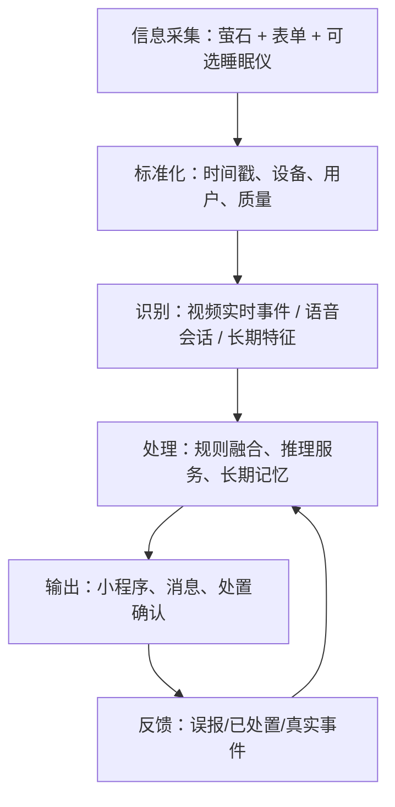
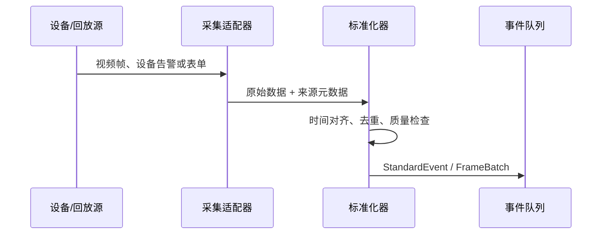
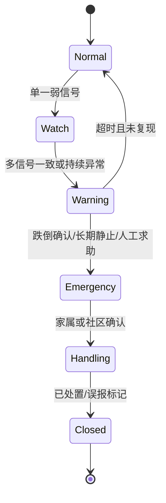

# 康盾：MVP 工程实现与模块 Pipeline 规划

> 基于三份项目资料收缩后的工程方案。目标是在 2026 年 9 月 5 日前形成可运行、可演示、可复现、基于萤石开放平台的闭环系统，而不是一次性建设面向 50 户生产部署的完整商业平台。

## 1. 结论：工程范围如何收缩

现有材料覆盖跌倒、认知、抑郁、诈骗四类风险，包含摄像头、睡眠仪、手环、门锁、红外传感器，以及 Spring Cloud、Kafka、Kubernetes、TimescaleDB、Milvus、Triton、APP、小程序和社区后台。该蓝图适合作为远期产品架构，但不适合作为当前比赛原型的实际开发清单。

本阶段建议采用“一条主线、两个增强、一个闭环”：

- 主线：**跌倒风险全流程**，实现跌倒前失稳/高危动作预判、跌倒过程识别、跌倒后静止确认与升级告警。
- 增强 1：**心理健康趋势筛查**，只做抑郁/认知相关的非诊断性周级风险趋势，不训练临床诊断模型。
- 增强 2：**诈骗场景识别**，以模拟对话或用户主动开启的守护模式完成关键词、语义与行为联合判断，不做全天候窃听。
- 闭环：事件产生 → 风险融合 → 分级告警 → 家属确认/误报 → 留痕 → 阈值迭代。

这能对应评审的“前置预判—过程识别—分级预警”、多模态融合、适老化和实测复现四个重点，同时控制工程复杂度。

### 1.1 MVP 必做、选做与暂缓

| 层级 | 能力 | 决策 |
|---|---|---|
| 必做 | 萤石设备授权、设备状态、告警订阅、抓图/视频预览或回放 | 必须体现基于萤石开放平台 |
| 必做 | 单路摄像头视频分析：人体、姿态、高危动作、跌倒、静止 | 核心演示链路 |
| 必做 | 事件标准化、规则/评分融合、三级预警、处置反馈 | 形成业务闭环 |
| 必做 | 家属/社区共用的微信小程序或 Web H5 | 只维护一个前端代码库 |
| 必做 | 老人档案、设备、事件、风险日报/周报、审计记录 | 最小业务数据模型 |
| 选做 | 睡眠仪在床/离床、睡眠摘要接入 | 有真机和 API 权限再接入 |
| 选做 | 诈骗文本/语音演示、心理周趋势 | 作为独立插件，不阻塞主链路 |
| 暂缓 | 手环、智能门锁、多个红外设备 | 接口预留，不进入首轮联调 |
| 暂缓 | React Native APP + 原生小程序双端 | 只做小程序/H5 |
| 暂缓 | Spring Cloud、Kafka、K8s、Milvus、InfluxDB、Triton | 单体后端 + 后台任务 + PostgreSQL/SQLite 足够 |
| 暂缓 | Transformer 多模态端到端训练、跨模态对比学习 | 小样本无法有效支撑 |
| 暂缓 | 50 户容量、99.5% SLA、等保三级落地 | 作为远期规划，不作为已实现指标 |

## 2. 总体工程结构

系统采用“采集适配器—识别插件—风险编排—交互闭环”的单体模块化架构。开发期可在一台 GPU 工作站或服务器上用 Docker Compose 部署，边缘端和云端先逻辑分层，不强制物理分布式。



建议代码结构：

```text
kangdun/
├── apps/
│   ├── api/                 # FastAPI 业务 API、鉴权、WebSocket
│   ├── worker/              # 视频/语音/日报后台任务
│   └── miniapp/             # 微信小程序或 uni-app/H5
├── services/
│   ├── collectors/          # ezviz、sleep、form、replay 适配器
│   ├── recognizers/         # fall、pose、fraud、mental 插件
│   ├── inference/           # 模型加载、批处理、版本管理
│   ├── risk_engine/         # 规则、融合、状态机、解释
│   ├── memory/              # 基线、短期窗口、长期画像、摘要
│   ├── alerting/            # 告警路由、升级、通知、回执
│   └── reporting/           # 日报、周报和指标导出
├── domain/
│   ├── schemas/             # Event、Feature、Risk、Alert 数据契约
│   └── policies/            # 阈值、分级、隐私与留存策略
├── infra/
│   ├── db/                  # PostgreSQL/SQLite 表和迁移
│   ├── storage/             # 脱敏抓图/短片，本地或对象存储
│   └── ezviz/               # 萤石 OAuth、API、回调验签
├── configs/                 # 场景、模型、阈值配置
├── tests/
│   ├── unit/                # 规则和状态机
│   ├── integration/         # 设备回调到告警闭环
│   └── scenarios/           # 可复现实测脚本和标注
├── scripts/                 # 初始化、回放评测、导出报告
├── docker-compose.yml
└── README.md
```

## 3. 四大模块的具体 Pipeline

## 3.1 信息采集模块

### 输入源

1. 萤石摄像头：设备信息、在线状态、告警事件、抓图、预览/回放地址；能否直接取得原始流取决于最终设备型号与开放权限。
2. 睡眠仪（可选）：在床/离床事件和日级睡眠摘要。
3. 老人/家属表单：年龄、身高、跌倒史、慢病、用药、基线量表与联系人。
4. 实验回放源：本地 MP4/标注文件，保证没有真机时也可复现完整流水线。

### 流程



### 关键工程规则

- 所有数据统一携带 `event_id、elder_id、device_id、source、occurred_at、received_at、scene、quality`。
- 设备事件必须幂等：用 `source_event_id + device_id` 去重。
- 演示阶段时间同步目标放宽到 2 秒；跨模态窗口采用事件时间而非到达时间。
- 默认不长期保存原始视频/音频。普通帧只在内存中处理；只有中高风险事件在明确授权后保存短片或抓图。
- 原材料中“语音仅端侧提特征”与“Whisper 转写后云端 NLP”存在口径冲突。MVP 统一为：诈骗守护由用户主动开启，端侧/边缘转写，云端只接收脱敏文本特征；不做全天候环境录音。

## 3.2 识别模块

识别模块只负责“从观测中产出候选事件或特征”，不直接向用户告警。每个识别器遵守同一插件接口：

```text
input: Observation | FrameBatch | AudioSession | DailyAggregate
output: DetectionEvent[]
fields: label, confidence, features, evidence_ref, model_version, latency_ms
```

### A. 跌倒主线（实时）

1. 人体检测/跟踪：过滤无人物帧，维持短时 track。
2. 姿态估计：输出骨架关键点及可见性；首版可用 MediaPipe Pose，若真机视角效果差再替换模型。
3. 时序特征：躯干角度、髋部高度、质心下降速度、人体框宽高比、关键点速度、落地后静止时长。
4. 候选识别：
   - 前置风险：快速起身、弯腰失衡、蹒跚/明显摇摆、夜间离床未归；
   - 过程事件：快速垂直下降 + 姿态由站立转为横卧；
   - 后续确认：横卧/低位持续且运动量低。
5. 输出 `pre_fall_risk`、`suspected_fall`、`post_fall_immobility`，交由风险引擎合并。

第一版不承诺仅凭单目摄像头精确计算医学级步长、COP 面积和真实世界厘米速度；这些指标需要相机标定、足部可见性和稳定视角。比赛原型应优先验证可观察且可复现的事件特征。

### B. 诈骗增强（会话级）

`主动开启守护/模拟音频 → VAD 切分 → ASR → 敏感实体脱敏 → 关键词/话术分类 → 情绪与紧迫度 → 行为事件关联 → fraud_candidate`

话术类别沿用资料中的五类：权威恐吓、紧急求助、利诱投资、情感诱导、误导推销。仅凭关键词不能触发高风险；至少需要“语义高风险 + 紧迫/转账要求”，或与翻找银行卡、异常外出等第二信号联合。

### C. 心理健康增强（周级）

`日活动/睡眠/社交代理指标 + 可选语音情感 → 个人基线偏离 → 连续 7 天聚合 → 趋势风险`

输出为“关注提示”和趋势解释，不输出疾病诊断。首版采用可解释加权分数或轻量模型，不使用大模型直接给出临床结论。

## 3.3 处理模块：推理服务 + 长期记忆

### 推理服务

首版采用 Python 进程内模型服务或独立 FastAPI inference service：

- `/infer/pose`：帧批量姿态；
- `/infer/fall`：短时姿态序列分类；
- `/infer/fraud`：脱敏文本会话分类；
- `/health`、`/models`：健康检查和模型版本；
- 离线评测脚本与在线服务复用同一模型封装，避免演示与报告指标不一致。

仅当并发或 GPU 利用率确有瓶颈时再引入 Triton。比赛原型的关键不是服务框架复杂度，而是端到端延迟、可复现指标和故障降级。

### 三层记忆

| 记忆层 | 内容 | 保存方式 | 用途 |
|---|---|---|---|
| 短期上下文 | 最近 30–120 秒姿态、动作、在床/离床事件 | 内存/Redis，可不用 Redis 起步 | 时序确认和去抖 |
| 个体基线 | 近 7–14 天活动、睡眠、事件频率的均值与波动 | PostgreSQL 聚合表 | 判断“相对本人异常” |
| 长期画像 | 档案、风险周报、阈值版本、告警和反馈 | PostgreSQL | 趋势、解释和追溯 |

“长期记忆”不等同于向量数据库。MVP 的主要查询是按老人和时间范围检索，关系数据库即可；只有未来需要相似案例语义检索时再引入 pgvector/Milvus。

### 风险融合状态机



建议初始分级：

- L0 记录：低置信候选，只进入日志。
- L1 关注：前置风险或周趋势异常，小程序提示，不打扰老人。
- L2 警告：疑似跌倒、疑似诈骗等，需要家属在 60 秒内确认；可通过设备语音询问老人。
- L3 紧急：跌倒后静止、老人主动求助、L2 超时且风险持续；按联系人顺序升级。

每个风险输出都必须带 `reason_codes` 和关键证据，例如“髋部快速下降 + 横卧 8 秒 + 无明显运动”，禁止只展示一个不可解释分数。

### 处理模块核心伪流程

```text
on DetectionEvent(event):
    validate_and_deduplicate(event)
    context = load_recent_context(event.elder_id)
    baseline = load_personal_baseline(event.elder_id)
    decision = risk_engine.evaluate(event, context, baseline, policy_version)
    persist(event, decision)
    if decision.level >= L2:
        alert = create_or_merge_alert(decision)
        dispatch(alert)
    update_aggregates_async(event)
```

## 3.4 输出模块

### 用户角色与最小界面

| 角色 | 必要页面 |
|---|---|
| 老人 | 一键求助、当前守护状态、设备语音确认；避免复杂操作 |
| 家属 | 首页状态、预警详情、视频/抓图证据、联系老人、确认处置、误报反馈、周报 |
| 社区人员 | 高风险老人列表、待处置事件、处置记录；MVP 可与家属端共用界面并用角色控制 |

最小页面共 6 个：登录/授权、老人绑定、设备状态、首页概览、预警详情与处置、风险周报。实时视频页调用萤石能力，不自行转封装 WebRTC，除非开放平台 SDK 无法满足目标端。

### 通知与处置闭环

1. 风险引擎创建 Alert，避免同一事件重复推送。
2. 小程序订阅消息优先；开发演示期可用站内消息/WebSocket，短信作为 L3 可选渠道。
3. 家属查看证据，选择“已联系、已现场处置、误报”。
4. 超时未确认则升级到第二联系人/社区人员。
5. 反馈写回事件，进入按场景统计的误报分析，但不自动在线更新模型。

## 4. 统一数据契约

建议以 JSON Schema/Pydantic 固化接口，避免四个模块各自定义字段。

```json
{
  "event_id": "uuid",
  "elder_id": "elder_demo_01",
  "device_id": "camera_livingroom_01",
  "source": "video_fall_recognizer",
  "event_type": "suspected_fall",
  "occurred_at": "2026-07-12T20:10:21+09:00",
  "scene": "living_room",
  "confidence": 0.91,
  "features": {
    "vertical_drop": 0.68,
    "horizontal_duration_s": 8.2,
    "motion_after_event": 0.04
  },
  "evidence_ref": "evidence/evt_xxx.jpg",
  "model_version": "fall-v0.2.0",
  "privacy_level": "derived_feature"
}
```

核心表只需：`elder、contact、device、observation_event、risk_snapshot、alert、alert_action、daily_feature、model_version、consent_audit`。

## 5. 推荐技术栈

| 部分 | MVP 选择 | 原因 |
|---|---|---|
| 后端 | FastAPI + Pydantic + SQLAlchemy | 与算法同为 Python，接口契约清晰 |
| 异步任务 | FastAPI BackgroundTasks / APScheduler；需要时升级 Celery | 日报和回放评测够用 |
| 数据库 | 开发 SQLite，联调 PostgreSQL | 单库覆盖业务、时序聚合和审计 |
| 推理 | PyTorch/ONNX Runtime + OpenCV + MediaPipe/轻量姿态模型 | 易离线复现与部署 |
| 前端 | uni-app/微信小程序，或 Vue H5 套壳 | 单代码库完成演示 |
| 部署 | Docker Compose + Nginx | 一条命令启动、便于交付 |
| 监控 | 结构化日志 + Prometheus 可选 | 首版先保证事件可追踪 |
| 测试 | pytest + 固定视频回放集 + API 集成测试 | 输出可复现指标 |

如果团队已有稳定 Java 后端成员，可保留 Spring Boot 单体；不建议当前就上 Spring Cloud 微服务。

## 6. 失败降级设计

- 萤石设备离线：前端展示离线，不把“无数据”解释为“老人安全”。
- 实时流不可用：用萤石告警回调触发抓图/短片分析；演示用本地视频回放。
- 姿态关键点质量低：事件降级为 L0/L1，不触发紧急告警。
- 睡眠仪未获权限：使用手工导入的日摘要接口或关闭该插件，不阻塞跌倒主线。
- GPU 不可用：ONNX/CPU 低帧率采样；明确实时目标按实际设备测量。
- 通知失败：记录渠道状态并尝试下一渠道，禁止静默丢失。
- 大模型/ASR 不可用：诈骗模块回退关键词与规则，不影响跌倒闭环。

## 7. 8 周实施计划与验收门

### 第 1 周：冻结范围与数据契约

- 确认萤石设备型号、开放 API 权限、授权流程和可取得的数据形态。
- 固化四类事件 Schema、数据库表、场景脚本和隐私授权文案。
- 验收：本地模拟事件可从采集接口写入数据库并显示。

### 第 2 周：萤石接入与回放框架

- 完成 OAuth/Token、设备列表、在线状态、告警回调验签与幂等。
- 建立本地视频 + 标注回放工具。
- 验收：真实设备事件和回放事件使用同一接口进入系统。

### 第 3–4 周：跌倒主线

- 完成人体/姿态/时序特征、候选事件、后续静止确认。
- 建立至少 5 类负样本：坐下、躺床、捡物、蹲下、遮挡。
- 验收：固定测试集输出准确率、召回率、F1、误报/小时、检测延迟。

### 第 5 周：风险引擎与告警闭环

- 完成三级预警、事件合并、超时升级、处置与误报反馈。
- 验收：从回放跌倒到小程序告警，再到确认关闭全链路可演示。

### 第 6 周：小程序与适老化

- 完成 6 个最小页面、大字体/高对比、角色权限和失败状态。
- 验收：老人一键求助不超过 1 次点击；家属处置不超过 3 步。

### 第 7 周：两个增强插件

- 完成诈骗模拟会话；心理模块完成 7 天趋势数据演示。
- 若主线仍不稳定，本周全部投入主线，不强行交付增强功能。
- 验收：插件关闭后系统仍完整运行；输出明确“风险提示而非诊断”。

### 第 8 周：实测、材料和一键部署

- 完成场景测试、消融对比、隐私检查、部署文档和演示脚本。
- 验收：新电脑按 README 一条命令启动；固定数据集可重跑得到报告中的指标。

## 8. 测试与比赛证据链

### 跌倒场景测试矩阵

至少覆盖：客厅/卧室门口、白天/夜间、正面/侧面、单人/部分遮挡、跌倒/近跌倒/日常动作。每个测试视频记录场景、机位、真值起止时间、模型版本和结果。

核心指标：

- 事件级 Precision、Recall、F1，而不只报 Accuracy；
- 每小时误报数；
- 从动作发生到告警产生的 P50/P95 延迟；
- 设备数据成功率、事件推送成功率、处置闭环完成率；
- 分场景结果与失败案例。

### 消融实验

至少提供三组：单帧姿态规则、加入时序下降特征、再加入跌倒后静止确认。这样可以直接证明“多阶段识别”对误报率的改善，形成工程创新证据。

### 演示脚本

1. 家属授权并绑定萤石摄像头；显示设备在线。
2. 正常坐下/捡物不告警。
3. 高危失稳触发 L1 语音提醒或关注提示。
4. 模拟跌倒并保持静止，系统从 L2 升级 L3。
5. 家属收到消息、查看证据、联系老人并确认处置。
6. 周报展示事件趋势、解释和隐私留存状态。
7. 可选演示诈骗对话触发多信号预警。

## 9. 开发前必须确认的外部依赖

以下问题应尽快向萤石指导团队确认，否则会直接改变采集 pipeline：

1. 提供的摄像头和睡眠仪具体型号、数量、到货时间。
2. 开放平台能否获取实时流、抓图、告警短片，以及小程序 SDK 支持范围。
3. 告警回调类型、时延、签名方式和测试环境。
4. 睡眠仪能提供原始数据、实时事件还是日级报告，各字段与调用频率限制。
5. 是否开放 AI 人形/姿态相关能力，输出是事件标签、框还是关键点。
6. 数据存储地域、授权条款、参赛测试账号和调用额度。

在答案确认前，所有外部能力必须通过 Adapter 隔离并提供 Mock，禁止让主流程直接依赖某个未获授权的 API。

## 10. 最终交付清单

- 可执行源代码与固定版本依赖；
- Docker Compose 一键部署与示例配置；
- 萤石授权、设备绑定和回调配置说明；
- 模型文件、版本、训练/阈值来源和推理说明；
- 脱敏测试集、场景标注和一键评测脚本；
- 功能测试、性能测试、失败案例和复现报告；
- 数据授权、隐私、留存和删除机制说明；
- 5–8 分钟演示脚本与备用离线回放方案；
- 系统设计文档、API 文档和模块负责人表。

## 11. 当前最关键的下一步

不要立即并行开发四类模型。先用一段本地跌倒视频打通以下纵向切片：

`视频回放 → 姿态识别 → suspected_fall 事件 → 风险状态机 → 小程序告警 → 人工确认 → 数据库留痕`

当这条切片可稳定复现后，再把回放源替换为萤石流/告警，把诈骗和心理模块作为同一事件契约下的插件接入。这样每增加一个识别能力，都不会重新改造采集、处理和输出层。

---

## 资料依据与方案取舍说明

- 比赛方案明确要求基于萤石开放平台，强调“前置预判—过程识别—分级预警”、精准性与响应效能、适老化、隐私合规和可复现材料。
- 项目 PPT 给出了端—边—云—应用、实时异常与长期评估并行、预警处置反馈闭环及萤石能力申请方向。
- 《监测方案》提出七维数据和四风险方向，并给出 10–30 户、6 周验证设想；本规划保留其个体基线、多信号融合与隐私优先原则，但将硬件、模型和基础设施缩减到比赛周期内可验证的最小集合。
